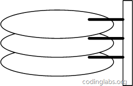
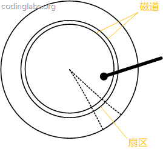

# 摘自：[http://outofmemory.cn/mysql/mysql-index-arithmetic](http://outofmemory.cn/mysql/mysql-index-arithmetic)

# 摘要

本文以MySQL数据库为研究对象，讨论与数据库索引相关的一些话题。特别需要说明的是，MySQL支持诸多存储引擎，而各种存储引擎对索引的支持也各不相同，因此MySQL数据库支持多种索引类型，如BTree索引，哈希索引，全文索引等等。为了避免混乱，本文将只关注于BTree索引，因为这是平常使用MySQL时主要打交道的索引，至于哈希索引和全文索引本文暂不讨论。

文章主要内容分为三个部分。

第一部分主要从数据结构及算法理论层面讨论MySQL数据库索引的数理基础。

第二部分结合MySQL数据库中MyISAM和InnoDB数据存储引擎中索引的架构实现讨论聚集索引、非聚集索引及覆盖索引等话题。

第三部分根据上面的理论基础，讨论MySQL中高性能使用索引的策略。

# 数据结构及算法基础

## 索引的本质

MySQL官方对索引的定义为：索引（Index）是帮助MySQL高效获取数据的数据结构。提取句子主干，就可以得到索引的本质：索引是数据结构。

我们知道，数据库查询是数据库的最主要功能之一。我们都希望查询数据的速度能尽可能的快，因此数据库系统的设计者会从查询算法的角度进行优化。最基本的查询算法当然是 [顺序查找 ](http://en.wikipedia.org/wiki/Linear_search)（linear search），这种复杂度为O(n)的算法在数据量很大时显然是糟糕的，好在计算机科学的发展提供了很多更优秀的查找算法，例如 [二分查找 ](http://en.wikipedia.org/wiki/Binary_search_algorithm)（binary search）、 [二叉树查找 ](http://en.wikipedia.org/wiki/Binary_search_tree)（binary tree search）等。如果稍微分析一下会发现，每种查找算法都只能应用于特定的数据结构之上，例如二分查找要求被检索数据有序，而二叉树查找只能应用于 [二叉查找树 ](http://en.wikipedia.org/wiki/Binary_search_tree)上，但是数据本身的组织结构不可能完全满足各种数据结构（例如，理论上不可能同时将两列都按顺序进行组织），所以，在数据之外，数据库系统还维护着满足特定查找算法的数据结构，这些数据结构以某种方式引用（指向）数据，这样就可以在这些数据结构上实现高级查找算法。这种数据结构，就是索引。

看一个例子：

图1

图1展示了一种可能的索引方式。左边是数据表，一共有两列七条记录，最左边的是数据记录的物理地址（注意逻辑上相邻的记录在磁盘上也并不是一定物理相邻的）。为了加快Col2的查找，可以维护一个右边所示的二叉查找树，每个节点分别包含索引键值和一个指向对应数据记录物理地址的指针，这样就可以运用二叉查找在O(log2n)的复杂度内获取到相应数据。

虽然这是一个货真价实的索引，但是实际的数据库系统几乎没有使用二叉查找树或其进化品种 [红黑树 ](http://en.wikipedia.org/wiki/Red-black_tree)（red-black tree）实现的，原因会在下文介绍。

## B-Tree和B+Tree

目前大部分数据库系统及文件系统都采用B-Tree或其变种B+Tree作为索引结构，在本文的下一节会结合存储器原理及计算机存取原理讨论为什么B-Tree和B+Tree在被如此广泛用于索引，这一节先单纯从数据结构角度描述它们。

### B-Tree

为了描述B-Tree，首先定义一条数据记录为一个二元组[key, data]，key为记录的键值，对于不同数据记录，key是互不相同的；data为数据记录除key外的数据。那么B-Tree是满足下列条件的数据结构：

d为大于1的一个正整数，称为B-Tree的度。

h为一个正整数，称为B-Tree的高度。

每个非叶子节点由n-1个key和n个指针组成，其中d<=n<=2d。

每个叶子节点最少包含一个key和两个指针，最多包含2d-1个key和2d个指针，叶节点的指针均为null 。

所有叶节点具有相同的深度，等于树高h。

key和指针互相间隔，节点两端是指针。

一个节点中的key从左到右非递减排列。

所有节点组成树结构。

每个指针要么为null，要么指向另外一个节点。

如果某个指针在节点node最左边且不为null，则其指向节点的所有key小于v(key1)，其中v(key1)为node的第一个key的值。

如果某个指针在节点node最右边且不为null，则其指向节点的所有key大于v(keym)，其中v(keym)为node的最后一个key的值。

如果某个指针在节点node的左右相邻key分别是keyi和keyi+1且不为null，则其指向节点的所有key小于v(keyi+1)且大于v(keyi)。

图2是一个d=2的B-Tree示意图。

图2

由于B-Tree的特性，在B-Tree中按key检索数据的算法非常直观：首先从根节点进行二分查找，如果找到则返回对应节点的data，否则对相应区间的指针指向的节点递归进行查找，直到找到节点或找到null指针，前者查找成功，后者查找失败。B-Tree上查找算法的伪代码如下：

BTree_Search(node, key){
    if(node ==null)returnnull;
    foreach(node.key)
    {
        if(node.key[i]== key)return node.data[i];
        if(node.key[i]> key)return BTree_Search(point[i]->node);
    }
    return BTree_Search(point[i+1]->node);
}
data =BTree_Search(root, my_key);

11

 

1

2

    BTree_Search(node, key){

3

        if(node==null)returnnull;

4

        foreach(node.key)

5

        {

6

            if(node.key[i]==key)returnnode.data[i];

7

            if(node.key[i]>key)returnBTree_Search(point[i]->node);

8

        }

9

        returnBTree_Search(point[i+1]->node);

10

    }

11

    data=BTree_Search(root, my_key);

关于B-Tree有一系列有趣的性质，例如一个度为d的B-Tree，设其索引N个key，则其树高h的上限为logd((N+1)/2)，检索一个key，其查找节点个数的渐进复杂度为O(logdN)。从这点可以看出，B-Tree是一个非常有效率的索引数据结构。

另外，由于插入删除新的数据记录会破坏B-Tree的性质，因此在插入删除时，需要对树进行一个分裂、合并、转移等操作以保持B-Tree性质，本文不打算完整讨论B-Tree这些内容，因为已经有许多资料详细说明了B-Tree的数学性质及插入删除算法，有兴趣的朋友可以在本文末的参考文献一栏找到相应的资料进行阅读。

### B+Tree

B-Tree有许多变种，其中最常见的是B+Tree，例如MySQL就普遍使用B+Tree实现其索引结构。

与B-Tree相比，B+Tree有以下不同点：

每个节点的指针上限为2d而不是2d+1。

内节点不存储data，只存储key；叶子节点不存储指针。

图3是一个简单的B+Tree示意。

图3

由于并不是所有节点都具有相同的域，因此B+Tree中叶节点和内节点一般大小不同。这点与B-Tree不同，虽然B-Tree中不同节点存放的key和指针可能数量不一致，但是每个节点的域和上限是一致的，所以在实现中B-Tree往往对每个节点申请同等大小的空间。

一般来说，B+Tree比B-Tree更适合实现外存储索引结构，具体原因与外存储器原理及计算机存取原理有关，将在下面讨论。

### 带有顺序访问指针的B+Tree

一般在数据库系统或文件系统中使用的B+Tree结构都在经典B+Tree的基础上进行了优化，增加了顺序访问指针。

图4

如图4所示，在B+Tree的每个叶子节点增加一个指向相邻叶子节点的指针，就形成了带有顺序访问指针的B+Tree。做这个优化的目的是为了提高区间访问的性能，例如图4中如果要查询key为从18到49的所有数据记录，当找到18后，只需顺着节点和指针顺序遍历就可以一次性访问到所有数据节点，极大提到了区间查询效率。

这一节对B-Tree和B+Tree进行了一个简单的介绍，下一节结合存储器存取原理介绍为什么目前B+Tree是数据库系统实现索引的首选数据结构。

## 为什么使用B-Tree（B+Tree）

上文说过，红黑树等数据结构也可以用来实现索引，但是文件系统及数据库系统普遍采用B-/+Tree作为索引结构，这一节将结合计算机组成原理相关知识讨论B-/+Tree作为索引的理论基础。

一般来说，索引本身也很大，不可能全部存储在内存中，因此索引往往以索引文件的形式存储的磁盘上。这样的话，索引查找过程中就要产生磁盘I/O消耗，相对于内存存取，I/O存取的消耗要高几个数量级，所以评价一个数据结构作为索引的优劣最重要的指标就是在查找过程中磁盘I/O操作次数的渐进复杂度。换句话说，索引的结构组织要尽量减少查找过程中磁盘I/O的存取次数。下面先介绍内存和磁盘存取原理，然后再结合这些原理分析B-/+Tree作为索引的效率。

### 主存存取原理

目前计算机使用的主存基本都是随机读写存储器（RAM），现代RAM的结构和存取原理比较复杂，这里本文抛却具体差别，抽象出一个十分简单的存取模型来说明RAM的工作原理。

图5

从抽象角度看，主存是一系列的存储单元组成的矩阵，每个存储单元存储固定大小的数据。每个存储单元有唯一的地址，现代主存的编址规则比较复杂，这里将其简化成一个二维地址：通过一个行地址和一个列地址可以唯一定位到一个存储单元。图5展示了一个4 x 4的主存模型。

主存的存取过程如下：

当系统需要读取主存时，则将地址信号放到地址总线上传给主存，主存读到地址信号后，解析信号并定位到指定存储单元，然后将此存储单元数据放到数据总线上，供其它部件读取。

写主存的过程类似，系统将要写入单元地址和数据分别放在地址总线和数据总线上，主存读取两个总线的内容，做相应的写操作。

这里可以看出，主存存取的时间仅与存取次数呈线性关系，因为不存在机械操作，两次存取的数据的“距离”不会对时间有任何影响，例如，先取A0再取A1和先取A0再取D3的时间消耗是一样的。

### 磁盘存取原理

上文说过，索引一般以文件形式存储在磁盘上，索引检索需要磁盘I/O操作。与主存不同，磁盘I/O存在机械运动耗费，因此磁盘I/O的时间消耗是巨大的。

图6是磁盘的整体结构示意图。

图6

一个磁盘由大小相同且同轴的圆形盘片组成，磁盘可以转动（各个磁盘必须同步转动）。在磁盘的一侧有磁头支架，磁头支架固定了一组磁头，每个磁头负责存取一个磁盘的内容。磁头不能转动，但是可以沿磁盘半径方向运动（实际是斜切向运动），每个磁头同一时刻也必须是同轴的，即从正上方向下看，所有磁头任何时候都是重叠的（不过目前已经有多磁头独立技术，可不受此限制）。

图7是磁盘结构的示意图。

图7

盘片被划分成一系列同心环，圆心是盘片中心，每个同心环叫做一个磁道，所有半径相同的磁道组成一个柱面。磁道被沿半径线划分成一个个小的段，每个段叫做一个扇区，每个扇区是磁盘的最小存储单元。为了简单起见，我们下面假设磁盘只有一个盘片和一个磁头。

当需要从磁盘读取数据时，系统会将数据逻辑地址传给磁盘，磁盘的控制电路按照寻址逻辑将逻辑地址翻译成物理地址，即确定要读的数据在哪个磁道，哪个扇区。为了读取这个扇区的数据，需要将磁头放到这个扇区上方，为了实现这一点，磁头需要移动对准相应磁道，这个过程叫做寻道，所耗费时间叫做寻道时间，然后磁盘旋转将目标扇区旋转到磁头下，这个过程耗费的时间叫做旋转时间。

### 局部性原理与磁盘预读

由于存储介质的特性，磁盘本身存取就比主存慢很多，再加上机械运动耗费，磁盘的存取速度往往是主存的几百分分之一，因此为了提高效率，要尽量减少磁盘I/O。为了达到这个目的，磁盘往往不是严格按需读取，而是每次都会预读，即使只需要一个字节，磁盘也会从这个位置开始，顺序向后读取一定长度的数据放入内存。这样做的理论依据是计算机科学中著名的局部性原理：

当一个数据被用到时，其附近的数据也通常会马上被使用。

程序运行期间所需要的数据通常比较集中。

由于磁盘顺序读取的效率很高（不需要寻道时间，只需很少的旋转时间），因此对于具有局部性的程序来说，预读可以提高I/O效率。

预读的长度一般为页（page）的整倍数。页是计算机管理存储器的逻辑块，硬件及操作系统往往将主存和磁盘存储区分割为连续的大小相等的块，每个存储块称为一页（在许多操作系统中，页得大小通常为4k），主存和磁盘以页为单位交换数据。当程序要读取的数据不在主存中时，会触发一个缺页异常，此时系统会向磁盘发出读盘信号，磁盘会找到数据的起始位置并向后连续读取一页或几页载入内存中，然后异常返回，程序继续运行。

### B-/+Tree索引的性能分析

到这里终于可以分析B-/+Tree索引的性能了。

上文说过一般使用磁盘I/O次数评价索引结构的优劣。先从B-Tree分析，根据B-Tree的定义，可知检索一次最多需要访问h个节点。数据库系统的设计者巧妙利用了磁盘预读原理，将一个节点的大小设为等于一个页，这样每个节点只需要一次I/O就可以完全载入。为了达到这个目的，在实际实现B-Tree还需要使用如下技巧：

每次新建节点时，直接申请一个页的空间，这样就保证一个节点物理上也存储在一个页里，加之计算机存储分配都是按页对齐的，就实现了一个node只需一次I/O。

B-Tree中一次检索最多需要h-1次I/O（根节点常驻内存），渐进复杂度为O(h)=O(logdN)。一般实际应用中，出度d是非常大的数字，通常超过100，因此h非常小（通常不超过3）。

综上所述，用B-Tree作为索引结构效率是非常高的。

而红黑树这种结构，h明显要深的多。由于逻辑上很近的节点（父子）物理上可能很远，无法利用局部性，所以红黑树的I/O渐进复杂度也为O(h)，效率明显比B-Tree差很多。

上文还说过，B+Tree更适合外存索引，原因和内节点出度d有关。从上面分析可以看到，d越大索引的性能越好，而出度的上限取决于节点内key和data的大小：

dmax=floor(pagesize/(keysize+datasize+pointsize))

floor表示向下取整。由于B+Tree内节点去掉了data域，因此可以拥有更大的出度，拥有更好的性能。

这一章从理论角度讨论了与索引相关的数据结构与算法问题，下一章将讨论B+Tree是如何具体实现为MySQL中索引，同时将结合MyISAM和InnDB存储引擎介绍非聚集索引和聚集索引两种不同的索引实现形式。

# MySQL索引实现

在MySQL中，索引属于存储引擎级别的概念，不同存储引擎对索引的实现方式是不同的，本文主要讨论MyISAM和InnoDB两个存储引擎的索引实现方式。

## MyISAM索引实现

MyISAM引擎使用B+Tree作为索引结构，叶节点的data域存放的是数据记录的地址。下图是MyISAM索引的原理图：

图8

这里设表一共有三列，假设我们以Col1为主键，则图8是一个MyISAM表的主索引（Primary key）示意。可以看出MyISAM的索引文件仅仅保存数据记录的地址。在MyISAM中，主索引和辅助索引（Secondary key）在结构上没有任何区别，只是主索引要求key是唯一的，而辅助索引的key可以重复。如果我们在Col2上建立一个辅助索引，则此索引的结构如下图所示：

图9

同样也是一颗B+Tree，data域保存数据记录的地址。因此，MyISAM中索引检索的算法为首先按照B+Tree搜索算法搜索索引，如果指定的Key存在，则取出其data域的值，然后以data域的值为地址，读取相应数据记录。

MyISAM的索引方式也叫做“非聚集”的，之所以这么称呼是为了与InnoDB的聚集索引区分。

## InnoDB索引实现

虽然InnoDB也使用B+Tree作为索引结构，但具体实现方式却与MyISAM截然不同。

第一个重大区别是InnoDB的数据文件本身就是索引文件。从上文知道，MyISAM索引文件和数据文件是分离的，索引文件仅保存数据记录的地址。而在InnoDB中，表数据文件本身就是按B+Tree组织的一个索引结构，这棵树的叶节点data域保存了完整的数据记录。这个索引的key是数据表的主键，因此InnoDB表数据文件本身就是主索引。

图10

图10是InnoDB主索引（同时也是数据文件）的示意图，可以看到叶节点包含了完整的数据记录。这种索引叫做聚集索引。因为InnoDB的数据文件本身要按主键聚集，所以InnoDB要求表必须有主键（MyISAM可以没有），如果没有显式指定，则MySQL系统会自动选择一个可以唯一标识数据记录的列作为主键，如果不存在这种列，则MySQL自动为InnoDB表生成一个隐含字段作为主键，这个字段长度为6个字节，类型为长整形。

第二个与MyISAM索引的不同是InnoDB的辅助索引data域存储相应记录主键的值而不是地址。换句话说，InnoDB的所有辅助索引都引用主键作为data域。例如，图11为定义在Col3上的一个辅助索引：

图11

这里以英文字符的ASCII码作为比较准则。聚集索引这种实现方式使得按主键的搜索十分高效，但是辅助索引搜索需要检索两遍索引：首先检索辅助索引获得主键，然后用主键到主索引中检索获得记录。

了解不同存储引擎的索引实现方式对于正确使用和优化索引都非常有帮助，例如知道了InnoDB的索引实现后，就很容易明白为什么不建议使用过长的字段作为主键，因为所有辅助索引都引用主索引，过长的主索引会令辅助索引变得过大。再例如，用非单调的字段作为主键在InnoDB中不是个好主意，因为InnoDB数据文件本身是一颗B+Tree，非单调的主键会造成在插入新记录时数据文件为了维持B+Tree的特性而频繁的分裂调整，十分低效，而使用自增字段作为主键则是一个很好的选择。

下一章将具体讨论这些与索引有关的优化策略。

# 索引使用策略及优化

MySQL的优化主要分为结构优化（Scheme optimization）和查询优化（Query optimization）。本章讨论的高性能索引策略主要属于结构优化范畴。本章的内容完全基于上文的理论基础，实际上一旦理解了索引背后的机制，那么选择高性能的策略就变成了纯粹的推理，并且可以理解这些策略背后的逻辑。

## 示例数据库

为了讨论索引策略，需要一个数据量不算小的数据库作为示例。本文选用MySQL官方文档中提供的示例数据库之一：employees。这个数据库关系复杂度适中，且数据量较大。下图是这个数据库的E-R关系图（引用自MySQL官方手册）：

图12

MySQL官方文档中关于此数据库的页面为 [http://dev.mysql.com/doc/employee/en/employee.html ](http://dev.mysql.com/doc/employee/en/employee.html)。里面详细介绍了此数据库，并提供了下载地址和导入方法，如果有兴趣导入此数据库到自己的MySQL可以参考文中内容。

## 最左前缀原理与相关优化

高效使用索引的首要条件是知道什么样的查询会使用到索引，这个问题和B+Tree中的“最左前缀原理”有关，下面通过例子说明最左前缀原理。

这里先说一下联合索引的概念。在上文中，我们都是假设索引只引用了单个的列，实际上，MySQL中的索引可以以一定顺序引用多个列，这种索引叫做联合索引，一般的，一个联合索引是一个有序元组<a1, a2, …, an>，其中各个元素均为数据表的一列，实际上要严格定义索引需要用到关系代数，但是这里我不想讨论太多关系代数的话题，因为那样会显得很枯燥，所以这里就不再做严格定义。另外，单列索引可以看成联合索引元素数为1的特例。

以employees.titles表为例，下面先查看其上都有哪些索引：

SHOW INDEX FROM employees.titles;
+--------+------------+----------+--------------+-------------+-----------+-------------+------+------------+
|Table|Non_unique|Key_name|Seq_in_index|Column_name|Collation|Cardinality|Null|Index_type|
+--------+------------+----------+--------------+-------------+-----------+-------------+------+------------+
| titles |0| PRIMARY |1| emp_no | A | NULL || BTREE |
| titles |0| PRIMARY |2| title | A | NULL || BTREE |
| titles |0| PRIMARY |3| from_date | A |443308|| BTREE |
| titles |1| emp_no |1| emp_no | A |443308|| BTREE |
+--------+------------+----------+--------------+-------------+-----------+-------------+------+------------+

10

 

1

2

    SHOWINDEXFROMemployees.titles;

3

    +--------+------------+----------+--------------+-------------+-----------+-------------+------+------------+

4

    |Table|Non_unique|Key_name|Seq_in_index|Column_name|Collation|Cardinality|Null|Index_type|

5

    +--------+------------+----------+--------------+-------------+-----------+-------------+------+------------+

6

    |titles|0|PRIMARY|1|emp_no|A|NULL||BTREE|

7

    |titles|0|PRIMARY|2|title|A|NULL||BTREE|

8

    |titles|0|PRIMARY|3|from_date|A|443308||BTREE|

9

    |titles|1|emp_no|1|emp_no|A|443308||BTREE|

10

    +--------+------------+----------+--------------+-------------+-----------+-------------+------+------------+

从结果中可以到titles表的主索引为<emp_no, title, from_date>，还有一个辅助索引<emp_no>。为了避免多个索引使事情变复杂（MySQL的SQL优化器在多索引时行为比较复杂），这里我们将辅助索引drop掉：

ALTER TABLE employees.titles DROP INDEX emp_no;

2

 

1

2

    ALTERTABLEemployees.titlesDROPINDEXemp_no;

这样就可以专心分析索引PRIMARY的行为了。

### 情况一：全列匹配。

EXPLAIN SELECT * FROM employees.titles WHERE emp_no='10001' AND title='Senior Engineer' AND from_date='1986-06-26';
+----+-------------+--------+-------+---------------+---------+---------+-------------------+------+-------+
| id | select_type | table | type | possible_keys | key | key_len |ref| rows |Extra|
+----+-------------+--------+-------+---------------+---------+---------+-------------------+------+-------+
|1| SIMPLE | titles |const| PRIMARY | PRIMARY |59|const,const,const|1||
+----+-------------+--------+-------+---------------+---------+---------+-------------------+------+-------+

7

 

1

2

    EXPLAINSELECT*FROMemployees.titlesWHEREemp_no='10001'ANDtitle='Senior Engineer'ANDfrom_date='1986-06-26';

3

    +----+-------------+--------+-------+---------------+---------+---------+-------------------+------+-------+

4

    |id|select_type|table|type|possible_keys|key|key_len|ref|rows|Extra|

5

    +----+-------------+--------+-------+---------------+---------+---------+-------------------+------+-------+

6

    |1|SIMPLE|titles|const|PRIMARY|PRIMARY|59|const,const,const|1||

7

    +----+-------------+--------+-------+---------------+---------+---------+-------------------+------+-------+

很明显，当按照索引中所有列进行精确匹配（这里精确匹配指“=”或“IN”匹配）时，索引可以被用到。这里有一点需要注意，理论上索引对顺序是敏感的，但是由于MySQL的查询优化器会自动调整where子句的条件顺序以使用适合的索引，例如我们将where中的条件顺序颠倒：

EXPLAIN SELECT * FROM employees.titles WHERE from_date='1986-06-26' AND emp_no='10001' AND title='Senior Engineer';
+----+-------------+--------+-------+---------------+---------+---------+-------------------+------+-------+
| id | select_type | table | type | possible_keys | key | key_len |ref| rows |Extra|
+----+-------------+--------+-------+---------------+---------+---------+-------------------+------+-------+
|1| SIMPLE | titles |const| PRIMARY | PRIMARY |59|const,const,const|1||
+----+-------------+--------+-------+---------------+---------+---------+-------------------+------+-------+

7

 

1

2

    EXPLAINSELECT*FROMemployees.titlesWHEREfrom_date='1986-06-26'ANDemp_no='10001'ANDtitle='Senior Engineer';

3

    +----+-------------+--------+-------+---------------+---------+---------+-------------------+------+-------+

4

    |id|select_type|table|type|possible_keys|key|key_len|ref|rows|Extra|

5

    +----+-------------+--------+-------+---------------+---------+---------+-------------------+------+-------+

6

    |1|SIMPLE|titles|const|PRIMARY|PRIMARY|59|const,const,const|1||

7

    +----+-------------+--------+-------+---------------+---------+---------+-------------------+------+-------+

效果是一样的。

### 情况二：最左前缀匹配。

EXPLAIN SELECT * FROM employees.titles WHERE emp_no='10001';
+----+-------------+--------+------+---------------+---------+---------+-------+------+-------+
| id | select_type | table | type | possible_keys | key | key_len |ref| rows |Extra|
+----+-------------+--------+------+---------------+---------+---------+-------+------+-------+
|1| SIMPLE | titles |ref| PRIMARY | PRIMARY |4|const|1||
+----+-------------+--------+------+---------------+---------+---------+-------+------+-------+

7

 

1

2

    EXPLAINSELECT*FROMemployees.titlesWHEREemp_no='10001';

3

    +----+-------------+--------+------+---------------+---------+---------+-------+------+-------+

4

    |id|select_type|table|type|possible_keys|key|key_len|ref|rows|Extra|

5

    +----+-------------+--------+------+---------------+---------+---------+-------+------+-------+

6

    |1|SIMPLE|titles|ref|PRIMARY|PRIMARY|4|const|1||

7

    +----+-------------+--------+------+---------------+---------+---------+-------+------+-------+

当查询条件精确匹配索引的左边连续一个或几个列时，如<emp_no>或<emp_no, title>，所以可以被用到，但是只能用到一部分，即条件所组成的最左前缀。上面的查询从分析结果看用到了PRIMARY索引，但是key_len为4，说明只用到了索引的第一列前缀。

### 情况三：查询条件用到了索引中列的精确匹配，但是中间某个条件未提供。

EXPLAIN SELECT * FROM employees.titles WHERE emp_no='10001' AND from_date='1986-06-26';
+----+-------------+--------+------+---------------+---------+---------+-------+------+-------------+
| id | select_type | table | type | possible_keys | key | key_len |ref| rows |Extra|
+----+-------------+--------+------+---------------+---------+---------+-------+------+-------------+
|1| SIMPLE | titles |ref| PRIMARY | PRIMARY |4|const|1|Usingwhere|
+----+-------------+--------+------+---------------+---------+---------+-------+------+-------------+

8

 

1

2

    EXPLAINSELECT*FROMemployees.titlesWHEREemp_no='10001'ANDfrom_date='1986-06-26';

3

    +----+-------------+--------+------+---------------+---------+---------+-------+------+-------------+

4

    |id|select_type|table|type|possible_keys|key|key_len|ref|rows|Extra|

5

    +----+-------------+--------+------+---------------+---------+---------+-------+------+-------------+

6

    |1|SIMPLE|titles|ref|PRIMARY|PRIMARY|4|const|1|Usingwhere|

7

    +----+-------------+--------+------+---------------+---------+---------+-------+------+-------------+

8

此时索引使用情况和情况二相同，因为title未提供，所以查询只用到了索引的第一列，而后面的from_date虽然也在索引中，但是由于title不存在而无法和左前缀连接，因此需要对结果进行扫描过滤from_date（这里由于emp_no唯一，所以不存在扫描）。如果想让from_date也使用索引而不是where过滤，可以增加一个辅助索引<emp_no, from_date>，此时上面的查询会使用这个索引。除此之外，还可以使用一种称之为“隔离列”的优化方法，将emp_no与from_date之间的“坑”填上。

首先我们看下title一共有几种不同的值：

SELECT DISTINCT(title) FROM employees.titles;
+--------------------+
| title |
+--------------------+
|SeniorEngineer|
|Staff|
|Engineer|
|SeniorStaff|
|AssistantEngineer|
|TechniqueLeader|
|Manager|
+--------------------+

13

 

1

2

    SELECTDISTINCT(title) FROMemployees.titles;

3

    +--------------------+

4

    |title|

5

    +--------------------+

6

    |SeniorEngineer|

7

    |Staff|

8

    |Engineer|

9

    |SeniorStaff|

10

    |AssistantEngineer|

11

    |TechniqueLeader|

12

    |Manager|

13

    +--------------------+

只有7种。在这种成为“坑”的列值比较少的情况下，可以考虑用“IN”来填补这个“坑”从而形成最左前缀：

EXPLAIN SELECT * FROM employees.titles
WHERE emp_no='10001'
AND title IN ('Senior Engineer','Staff','Engineer','Senior Staff','Assistant Engineer','Technique Leader','Manager')
AND from_date='1986-06-26';
+----+-------------+--------+-------+---------------+---------+---------+------+------+-------------+
| id | select_type | table | type | possible_keys | key | key_len |ref| rows |Extra|
+----+-------------+--------+-------+---------------+---------+---------+------+------+-------------+
|1| SIMPLE | titles | range | PRIMARY | PRIMARY |59| NULL |7|Usingwhere|
+----+-------------+--------+-------+---------------+---------+---------+------+------+-------------+

11

 

1

2

    EXPLAINSELECT*FROMemployees.titles

3

    WHEREemp_no='10001'

4

    ANDtitleIN ('Senior Engineer','Staff','Engineer','Senior Staff','Assistant Engineer','Technique Leader','Manager')

5

    ANDfrom_date='1986-06-26';

6

    +----+-------------+--------+-------+---------------+---------+---------+------+------+-------------+

7

    |id|select_type|table|type|possible_keys|key|key_len|ref|rows|Extra|

8

    +----+-------------+--------+-------+---------------+---------+---------+------+------+-------------+

9

    |1|SIMPLE|titles|range|PRIMARY|PRIMARY|59|NULL|7|Usingwhere|

10

    +----+-------------+--------+-------+---------------+---------+---------+------+------+-------------+

11

这次key_len为59，说明索引被用全了，但是从type和rows看出IN实际上执行了一个range查询，这里检查了7个key。看下两种查询的性能比较：

SHOW PROFILES;
+----------+------------+-------------------------------------------------------------------------------+
|Query_ID|Duration|Query|
+----------+------------+-------------------------------------------------------------------------------+
|10|0.00058000| SELECT * FROM employees.titles WHERE emp_no='10001' AND from_date='1986-06-26'|
|11|0.00052500| SELECT * FROM employees.titles WHERE emp_no='10001' AND title IN ...|
+----------+------------+-------------------------------------------------------------------------------+

8

 

1

2

    SHOWPROFILES;

3

    +----------+------------+-------------------------------------------------------------------------------+

4

    |Query_ID|Duration|Query|

5

    +----------+------------+-------------------------------------------------------------------------------+

6

    |10|0.00058000|SELECT*FROMemployees.titlesWHEREemp_no='10001'ANDfrom_date='1986-06-26'|

7

    |11|0.00052500|SELECT*FROMemployees.titlesWHEREemp_no='10001'ANDtitleIN...|

8

    +----------+------------+-------------------------------------------------------------------------------+

“填坑”后性能提升了一点。如果经过emp_no筛选后余下很多数据，则后者性能优势会更加明显。当然，如果title的值很多，用填坑就不合适了，必须建立辅助索引。

### 情况四：查询条件没有指定索引第一列。

EXPLAIN SELECT * FROM employees.titles WHERE from_date='1986-06-26';
+----+-------------+--------+------+---------------+------+---------+------+--------+-------------+
| id | select_type | table | type | possible_keys | key | key_len |ref| rows |Extra|
+----+-------------+--------+------+---------------+------+---------+------+--------+-------------+
|1| SIMPLE | titles | ALL | NULL | NULL | NULL | NULL |443308|Usingwhere|
+----+-------------+--------+------+---------------+------+---------+------+--------+-------------+

7

 

1

2

    EXPLAINSELECT*FROMemployees.titlesWHEREfrom_date='1986-06-26';

3

    +----+-------------+--------+------+---------------+------+---------+------+--------+-------------+

4

    |id|select_type|table|type|possible_keys|key|key_len|ref|rows|Extra|

5

    +----+-------------+--------+------+---------------+------+---------+------+--------+-------------+

6

    |1|SIMPLE|titles|ALL|NULL|NULL|NULL|NULL|443308|Usingwhere|

7

    +----+-------------+--------+------+---------------+------+---------+------+--------+-------------+

由于不是最左前缀，索引这样的查询显然用不到索引。

### 情况五：匹配某列的前缀字符串。

EXPLAIN SELECT * FROM employees.titles WHERE emp_no='10001' AND title LIKE 'Senior%';
+----+-------------+--------+-------+---------------+---------+---------+------+------+-------------+
| id | select_type | table | type | possible_keys | key | key_len |ref| rows |Extra|
+----+-------------+--------+-------+---------------+---------+---------+------+------+-------------+
|1| SIMPLE | titles | range | PRIMARY | PRIMARY |56| NULL |1|Usingwhere|
+----+-------------+--------+-------+---------------+---------+---------+------+------+-------------+

7

 

1

2

    EXPLAINSELECT*FROMemployees.titlesWHEREemp_no='10001'ANDtitleLIKE'Senior%';

3

    +----+-------------+--------+-------+---------------+---------+---------+------+------+-------------+

4

    |id|select_type|table|type|possible_keys|key|key_len|ref|rows|Extra|

5

    +----+-------------+--------+-------+---------------+---------+---------+------+------+-------------+

6

    |1|SIMPLE|titles|range|PRIMARY|PRIMARY|56|NULL|1|Usingwhere|

7

    +----+-------------+--------+-------+---------------+---------+---------+------+------+-------------+

此时可以用到索引，但是如果通配符不是只出现在末尾，则无法使用索引。（原文表述有误，如果通配符%不出现在开头，则可以用到索引，但根据具体情况不同可能只会用其中一个前缀）

### 情况六：范围查询。

EXPLAIN SELECT * FROM employees.titles WHERE emp_no <'10010'and title='Senior Engineer';
+----+-------------+--------+-------+---------------+---------+---------+------+------+-------------+
| id | select_type | table | type | possible_keys | key | key_len |ref| rows |Extra|
+----+-------------+--------+-------+---------------+---------+---------+------+------+-------------+
|1| SIMPLE | titles | range | PRIMARY | PRIMARY |4| NULL |16|Usingwhere|
+----+-------------+--------+-------+---------------+---------+---------+------+------+-------------+

7

 

1

2

    EXPLAINSELECT*FROMemployees.titlesWHEREemp_no<'10010'andtitle='Senior Engineer';

3

    +----+-------------+--------+-------+---------------+---------+---------+------+------+-------------+

4

    |id|select_type|table|type|possible_keys|key|key_len|ref|rows|Extra|

5

    +----+-------------+--------+-------+---------------+---------+---------+------+------+-------------+

6

    |1|SIMPLE|titles|range|PRIMARY|PRIMARY|4|NULL|16|Usingwhere|

7

    +----+-------------+--------+-------+---------------+---------+---------+------+------+-------------+

范围列可以用到索引（必须是最左前缀），但是范围列后面的列无法用到索引。同时，索引最多用于一个范围列，因此如果查询条件中有两个范围列则无法全用到索引。

EXPLAIN SELECT * FROM employees.titles
WHERE emp_no <'10010'
AND title='Senior Engineer'
AND from_date BETWEEN '1986-01-01' AND '1986-12-31';
+----+-------------+--------+-------+---------------+---------+---------+------+------+-------------+
| id | select_type | table | type | possible_keys | key | key_len |ref| rows |Extra|
+----+-------------+--------+-------+---------------+---------+---------+------+------+-------------+
|1| SIMPLE | titles | range | PRIMARY | PRIMARY |4| NULL |16|Usingwhere|
+----+-------------+--------+-------+---------------+---------+---------+------+------+-------------+

10

 

1

2

    EXPLAINSELECT*FROMemployees.titles

3

    WHEREemp_no<'10010'

4

    ANDtitle='Senior Engineer'

5

    ANDfrom_dateBETWEEN'1986-01-01'AND'1986-12-31';

6

    +----+-------------+--------+-------+---------------+---------+---------+------+------+-------------+

7

    |id|select_type|table|type|possible_keys|key|key_len|ref|rows|Extra|

8

    +----+-------------+--------+-------+---------------+---------+---------+------+------+-------------+

9

    |1|SIMPLE|titles|range|PRIMARY|PRIMARY|4|NULL|16|Usingwhere|

10

    +----+-------------+--------+-------+---------------+---------+---------+------+------+-------------+

可以看到索引对第二个范围索引无能为力。这里特别要说明MySQL一个有意思的地方，那就是仅用explain可能无法区分范围索引和多值匹配，因为在type中这两者都显示为range。同时，用了“between”并不意味着就是范围查询，例如下面的查询：

EXPLAIN SELECT * FROM employees.titles
WHERE emp_no BETWEEN '10001' AND '10010'
AND title='Senior Engineer'
AND from_date BETWEEN '1986-01-01' AND '1986-12-31';
+----+-------------+--------+-------+---------------+---------+---------+------+------+-------------+
| id | select_type | table | type | possible_keys | key | key_len |ref| rows |Extra|
+----+-------------+--------+-------+---------------+---------+---------+------+------+-------------+
|1| SIMPLE | titles | range | PRIMARY | PRIMARY |59| NULL |16|Usingwhere|
+----+-------------+--------+-------+---------------+---------+---------+------+------+-------------+

10

 

1

2

    EXPLAINSELECT*FROMemployees.titles

3

    WHEREemp_noBETWEEN'10001'AND'10010'

4

    ANDtitle='Senior Engineer'

5

    ANDfrom_dateBETWEEN'1986-01-01'AND'1986-12-31';

6

    +----+-------------+--------+-------+---------------+---------+---------+------+------+-------------+

7

    |id|select_type|table|type|possible_keys|key|key_len|ref|rows|Extra|

8

    +----+-------------+--------+-------+---------------+---------+---------+------+------+-------------+

9

    |1|SIMPLE|titles|range|PRIMARY|PRIMARY|59|NULL|16|Usingwhere|

10

    +----+-------------+--------+-------+---------------+---------+---------+------+------+-------------+

看起来是用了两个范围查询，但作用于emp_no上的“BETWEEN”实际上相当于“IN”，也就是说emp_no实际是多值精确匹配。可以看到这个查询用到了索引全部三个列。因此在MySQL中要谨慎地区分多值匹配和范围匹配，否则会对MySQL的行为产生困惑。

### 情况七：查询条件中含有函数或表达式。

很不幸，如果查询条件中含有函数或表达式，则MySQL不会为这列使用索引（虽然某些在数学意义上可以使用）。例如：

EXPLAIN SELECT * FROM employees.titles WHERE emp_no='10001' AND left(title,6)='Senior';
+----+-------------+--------+------+---------------+---------+---------+-------+------+-------------+
| id | select_type | table | type | possible_keys | key | key_len |ref| rows |Extra|
+----+-------------+--------+------+---------------+---------+---------+-------+------+-------------+
|1| SIMPLE | titles |ref| PRIMARY | PRIMARY |4|const|1|Usingwhere|
+----+-------------+--------+------+---------------+---------+---------+-------+------+-------------+

6

 

1

    EXPLAINSELECT*FROMemployees.titlesWHEREemp_no='10001'ANDleft(title,6)='Senior';

2

    +----+-------------+--------+------+---------------+---------+---------+-------+------+-------------+

3

    |id|select_type|table|type|possible_keys|key|key_len|ref|rows|Extra|

4

    +----+-------------+--------+------+---------------+---------+---------+-------+------+-------------+

5

    |1|SIMPLE|titles|ref|PRIMARY|PRIMARY|4|const|1|Usingwhere|

6

    +----+-------------+--------+------+---------------+---------+---------+-------+------+-------------+

虽然这个查询和情况五中功能相同，但是由于使用了函数left，则无法为title列应用索引，而情况五中用LIKE则可以。再如：

EXPLAIN SELECT * FROM employees.titles WHERE emp_no -1='10000';
+----+-------------+--------+------+---------------+------+---------+------+--------+-------------+
| id | select_type | table | type | possible_keys | key | key_len |ref| rows |Extra|
+----+-------------+--------+------+---------------+------+---------+------+--------+-------------+
|1| SIMPLE | titles | ALL | NULL | NULL | NULL | NULL |443308|Usingwhere|
+----+-------------+--------+------+---------------+------+---------+------+--------+-------------+

7

 

1

2

    EXPLAINSELECT*FROMemployees.titlesWHEREemp_no-1='10000';

3

    +----+-------------+--------+------+---------------+------+---------+------+--------+-------------+

4

    |id|select_type|table|type|possible_keys|key|key_len|ref|rows|Extra|

5

    +----+-------------+--------+------+---------------+------+---------+------+--------+-------------+

6

    |1|SIMPLE|titles|ALL|NULL|NULL|NULL|NULL|443308|Usingwhere|

7

    +----+-------------+--------+------+---------------+------+---------+------+--------+-------------+

显然这个查询等价于查询emp_no为10001的函数，但是由于查询条件是一个表达式，MySQL无法为其使用索引。看来MySQL还没有智能到自动优化常量表达式的程度，因此在写查询语句时尽量避免表达式出现在查询中，而是先手工私下代数运算，转换为无表达式的查询语句。

## 索引选择性与前缀索引

既然索引可以加快查询速度，那么是不是只要是查询语句需要，就建上索引？答案是否定的。因为索引虽然加快了查询速度，但索引也是有代价的：索引文件本身要消耗存储空间，同时索引会加重插入、删除和修改记录时的负担，另外，MySQL在运行时也要消耗资源维护索引，因此索引并不是越多越好。一般两种情况下不建议建索引。

第一种情况是表记录比较少，例如一两千条甚至只有几百条记录的表，没必要建索引，让查询做全表扫描就好了。至于多少条记录才算多，这个个人有个人的看法，我个人的经验是以2000作为分界线，记录数不超过 2000可以考虑不建索引，超过2000条可以酌情考虑索引。

另一种不建议建索引的情况是索引的选择性较低。所谓索引的选择性（Selectivity），是指不重复的索引值（也叫基数，Cardinality）与表记录数（#T）的比值：

Index Selectivity = Cardinality / #T

显然选择性的取值范围为(0, 1]，选择性越高的索引价值越大，这是由B+Tree的性质决定的。例如，上文用到的employees.titles表，如果title字段经常被单独查询，是否需要建索引，我们看一下它的选择性：

SELECT count(DISTINCT(title))/count(*) AS Selectivity FROM employees.titles;
+-------------+
|Selectivity|
+-------------+
|0.0000|
+-------------+

7

 

1

2

    SELECTcount(DISTINCT(title))/count(*) ASSelectivityFROMemployees.titles;

3

    +-------------+

4

    |Selectivity|

5

    +-------------+

6

    |0.0000|

7

    +-------------+

title的选择性不足0.0001（精确值为0.00001579），所以实在没有什么必要为其单独建索引。

有一种与索引选择性有关的索引优化策略叫做前缀索引，就是用列的前缀代替整个列作为索引key，当前缀长度合适时，可以做到既使得前缀索引的选择性接近全列索引，同时因为索引key变短而减少了索引文件的大小和维护开销。下面以employees.employees表为例介绍前缀索引的选择和使用。

从图12可以看到employees表只有一个索引<emp_no>，那么如果我们想按名字搜索一个人，就只能全表扫描了：

EXPLAIN SELECT * FROM employees.employees WHERE first_name='Eric' AND last_name='Anido';
+----+-------------+-----------+------+---------------+------+---------+------+--------+-------------+
| id | select_type | table | type | possible_keys | key | key_len |ref| rows |Extra|
+----+-------------+-----------+------+---------------+------+---------+------+--------+-------------+
|1| SIMPLE | employees | ALL | NULL | NULL | NULL | NULL |300024|Usingwhere|
+----+-------------+-----------+------+---------------+------+---------+------+--------+-------------+

7

 

1

2

    EXPLAINSELECT*FROMemployees.employeesWHEREfirst_name='Eric'ANDlast_name='Anido';

3

    +----+-------------+-----------+------+---------------+------+---------+------+--------+-------------+

4

    |id|select_type|table|type|possible_keys|key|key_len|ref|rows|Extra|

5

    +----+-------------+-----------+------+---------------+------+---------+------+--------+-------------+

6

    |1|SIMPLE|employees|ALL|NULL|NULL|NULL|NULL|300024|Usingwhere|

7

    +----+-------------+-----------+------+---------------+------+---------+------+--------+-------------+

如果频繁按名字搜索员工，这样显然效率很低，因此我们可以考虑建索引。有两种选择，建<first_name>或<first_name, last_name>，看下两个索引的选择性：

SELECT count(DISTINCT(first_name))/count(*) AS Selectivity FROM employees.employees;
+-------------+
|Selectivity|
+-------------+
|0.0042|
+-------------+
SELECT count(DISTINCT(concat(first_name, last_name)))/count(*) AS Selectivity FROM employees.employees;
+-------------+
|Selectivity|
+-------------+
|0.9313|
+-------------+

14

 

1

2

    SELECTcount(DISTINCT(first_name))/count(*) ASSelectivityFROMemployees.employees;

3

    +-------------+

4

    |Selectivity|

5

    +-------------+

6

    |0.0042|

7

    +-------------+

8

    SELECTcount(DISTINCT(concat(first_name, last_name)))/count(*) ASSelectivityFROMemployees.employees;

9

    +-------------+

10

    |Selectivity|

11

    +-------------+

12

    |0.9313|

13

    +-------------+

14

<first_name>显然选择性太低，<first_name, last_name>选择性很好，但是first_name和last_name加起来长度为30，有没有兼顾长度和选择性的办法？可以考虑用first_name和last_name的前几个字符建立索引，例如<first_name, left(last_name, 3)>，看看其选择性：

SELECT count(DISTINCT(concat(first_name, left(last_name,3))))/count(*) AS Selectivity FROM employees.employees;
+-------------+
|Selectivity|
+-------------+
|0.7879|
+-------------+

8

 

1

2

    SELECTcount(DISTINCT(concat(first_name, left(last_name,3))))/count(*) ASSelectivityFROMemployees.employees;

3

    +-------------+

4

    |Selectivity|

5

    +-------------+

6

    |0.7879|

7

    +-------------+

8

选择性还不错，但离0.9313还是有点距离，那么把last_name前缀加到4：

SELECT count(DISTINCT(concat(first_name, left(last_name,4))))/count(*) AS Selectivity FROM employees.employees;
+-------------+
|Selectivity|
+-------------+
|0.9007|
+-------------+

8

 

1

2

    SELECTcount(DISTINCT(concat(first_name, left(last_name,4))))/count(*) ASSelectivityFROMemployees.employees;

3

    +-------------+

4

    |Selectivity|

5

    +-------------+

6

    |0.9007|

7

    +-------------+

8

这时选择性已经很理想了，而这个索引的长度只有18，比<first_name, last_name>短了接近一半，我们把这个前缀索引 建上：

ALTER TABLE employees.employees
ADD INDEX `first_name_last_name4`(first_name, last_name(4));

3

 

1

2

    ALTERTABLEemployees.employees

3

    ADDINDEX`first_name_last_name4`(first_name, last_name(4));

此时再执行一遍按名字查询，比较分析一下与建索引前的结果：

SHOW PROFILES;
+----------+------------+---------------------------------------------------------------------------------+
|Query_ID|Duration|Query|
+----------+------------+---------------------------------------------------------------------------------+
|87|0.11941700| SELECT * FROM employees.employees WHERE first_name='Eric' AND last_name='Anido'|
|90|0.00092400| SELECT * FROM employees.employees WHERE first_name='Eric' AND last_name='Anido'|
+----------+------------+---------------------------------------------------------------------------------+

8

 

1

2

    SHOWPROFILES;

3

    +----------+------------+---------------------------------------------------------------------------------+

4

    |Query_ID|Duration|Query|

5

    +----------+------------+---------------------------------------------------------------------------------+

6

    |87|0.11941700|SELECT*FROMemployees.employeesWHEREfirst_name='Eric'ANDlast_name='Anido'|

7

    |90|0.00092400|SELECT*FROMemployees.employeesWHEREfirst_name='Eric'ANDlast_name='Anido'|

8

    +----------+------------+---------------------------------------------------------------------------------+

性能的提升是显著的，查询速度提高了120多倍。

前缀索引兼顾索引大小和查询速度，但是其缺点是不能用于ORDER BY和GROUP BY操作，也不能用于Covering index（即当索引本身包含查询所需全部数据时，不再访问数据文件本身）。

## InnoDB的主键选择与插入优化

在使用InnoDB存储引擎时，如果没有特别的需要，请永远使用一个与业务无关的自增字段作为主键。

经常看到有帖子或博客讨论主键选择问题，有人建议使用业务无关的自增主键，有人觉得没有必要，完全可以使用如学号或身份证号这种唯一字段作为主键。不论支持哪种论点，大多数论据都是业务层面的。如果从数据库索引优化角度看，使用InnoDB引擎而不使用自增主键绝对是一个糟糕的主意。

上文讨论过InnoDB的索引实现，InnoDB使用聚集索引，数据记录本身被存于主索引（一颗B+Tree）的叶子节点上。这就要求同一个叶子节点内（大小为一个内存页或磁盘页）的各条数据记录按主键顺序存放，因此每当有一条新的记录插入时，MySQL会根据其主键将其插入适当的节点和位置，如果页面达到装载因子（InnoDB默认为15/16），则开辟一个新的页（节点）。

如果表使用自增主键，那么每次插入新的记录，记录就会顺序添加到当前索引节点的后续位置，当一页写满，就会自动开辟一个新的页。如下图所示：

图13

这样就会形成一个紧凑的索引结构，近似顺序填满。由于每次插入时也不需要移动已有数据，因此效率很高，也不会增加很多开销在维护索引上。

如果使用非自增主键（如果身份证号或学号等），由于每次插入主键的值近似于随机，因此每次新纪录都要被插到现有索引页得中间某个位置：

图14

此时MySQL不得不为了将新记录插到合适位置而移动数据，甚至目标页面可能已经被回写到磁盘上而从缓存中清掉，此时又要从磁盘上读回来，这增加了很多开销，同时频繁的移动、分页操作造成了大量的碎片，得到了不够紧凑的索引结构，后续不得不通过OPTIMIZE TABLE来重建表并优化填充页面。

因此，只要可以，请尽量在InnoDB上采用自增字段做主键。

# 后记

这篇文章断断续续写了半个月，主要内容就是上面这些了。不可否认，这篇文章在一定程度上有纸上谈兵之嫌，因为我本人对MySQL的使用属于菜鸟级别，更没有太多数据库调优的经验，在这里大谈数据库索引调优有点大言不惭。就当是我个人的一篇学习笔记了。

其实数据库索引调优是一项技术活，不能仅仅靠理论，因为实际情况千变万化，而且MySQL本身存在很复杂的机制，如查询优化策略和各种引擎的实现差异等都会使情况变得更加复杂。但同时这些理论是索引调优的基础，只有在明白理论的基础上，才能对调优策略进行合理推断并了解其背后的机制，然后结合实践中不断的实验和摸索，从而真正达到高效使用MySQL索引的目的。

另外，MySQL索引及其优化涵盖范围非常广，本文只是涉及到其中一部分。如与排序（ORDER BY）相关的索引优化及覆盖索引（Covering index）的话题本文并未涉及，同时除B-Tree索引外MySQL还根据不同引擎支持的哈希索引、全文索引等等本文也并未涉及。如果有机会，希望再对本文未涉及的部分进行补充吧。

# 参考文献

[1] Baron Scbwartz等 著，王小东等 译；高性能MySQL（High Performance MySQL）；电子工业出版社，2010

[2] Michael Kofler 著，杨晓云等 译；MySQL5权威指南（The Definitive Guide to MySQL5）；人民邮电出版社，2006

[3] 姜承尧 著；MySQL技术内幕-InnoDB存储引擎；机械工业出版社，2011

[4] D Comer, Ubiquitous B-tree; ACM Computing Surveys (CSUR), 1979

[5] Codd, E. F. (1970). "A relational model of data for large shared data banks". Communications of the ACM, , Vol. 13, No. 6, pp. 377-387

[6] MySQL5.1参考手册 - [http://dev.mysql.com/doc/refman/5.1/zh/index.html](http://dev.mysql.com/doc/refman/5.1/zh/index.html)