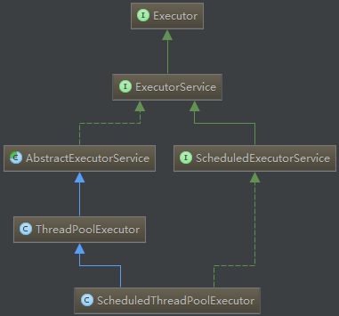

# 摘自：http://www.cnblogs.com/MOBIN/p/5436482.html

# [java并发编程--Executor框架](http://www.cnblogs.com/MOBIN/p/5436482.html)

**摘要：**

       Eexecutor作为灵活且强大的异步执行框架，其支持多种不同类型的任务执行策略，提供了一种标准的方法将任务的提交过程和执行过程解耦开发，基于生产者-消费者模式，其提交任务的线程相当于生产者，执行任务的线程相当于消费者，并用Runnable来表示任务，Executor的实现还提供了对生命周期的支持，以及统计信息收集，应用程序管理机制和性能监视等机制。

 

**1.Exexctor简介**

**Executor的UML图：（常用的几个接口和子类）**

****

**
**

**Executor：**一个接口，其定义了一个接收Runnable对象的方法executor，其方法签名为executor(Runnable command),

 

**ExecutorService：**是一个比Executor使用更广泛的子类接口，其提供了生命周期管理的方法，以及可跟踪一个或多个异步任务执行状况返回Future的方法

 

**AbstractExecutorService：**ExecutorService执行方法的默认实现

 

**ScheduledExecutorService**：一个可定时调度任务的接口

 

**ScheduledThreadPoolExecutor：ScheduledExecutorService的实现，一个可定时调度任务的线程池**

 

**ThreadPoolExecutor：**线程池，可以通过调用Executors以下静态工厂方法来创建线程池并返回一个ExecutorService对象：

 

**2.ThreadPoolExecutor构造函数的各个参数说明**

ThreadPoolExecutor方法签名：

    public ThreadPoolExecutor(int corePoolSize,
                              int maximumPoolSize,
                              long keepAliveTime,
                              TimeUnit unit,
                              BlockingQueue<Runnable> workQueue,
                              ThreadFactory threadFactory,
                              RejectedExecutionHandler handler) //后两个参数为可选参数

**参数说明：**

**corePoolSize：**核心线程数，如果运行的线程少于corePoolSize，则创建新线程来执行新任务，即使线程池中的其他线程是空闲的

 

**maximumPoolSize:**最大线程数，可允许创建的线程数，corePoolSize和maximumPoolSize设置的边界自动调整池大小：

**corePoolSize <运行的线程数<**** maximumPoolSize:**仅当队列满时才创建新线程

**corePoolSize=运行的线程数=**** maximumPoolSize：**创建固定大小的线程池

 

**keepAliveTime:**如果线程数多于corePoolSize,则这些多余的线程的空闲时间超过keepAliveTime时将被终止

 

**unit:**keepAliveTime参数的时间单位

** **

**workQueue:**保存任务的阻塞队列，与线程池的大小有关：

  当运行的线程数少于corePoolSize时，在有新任务时直接创建新线程来执行任务而无需再进队列

  当运行的线程数等于或多于corePoolSize，在有新任务添加时则选加入队列，不直接创建线程

  当队列满时，在有新任务时就创建新线程

 

**threadFactory:**使用ThreadFactory创建新线程，默认使用defaultThreadFactory创建线程

 

**handle:**定义处理被拒绝任务的策略，默认使用ThreadPoolExecutor.AbortPolicy,任务被拒绝时将抛出RejectExecutorException

 

**3.Executors：**提供了一系列静态工厂方法用于创建各种线程池

   newFixedThreadPool:创建可重用且固定线程数的线程池，如果线程池中的所有线程都处于活动状态，此时再提交任务就在队列中等待，直到有可用线程；如果线程池中的某个线程由于异常而结束时，线程池就会再补充一条新线程。

方法签名：

    publicstatic ExecutorService newFixedThreadPool(int nThreads) {
        returnnew ThreadPoolExecutor(nThreads, nThreads,
                                      0L, TimeUnit.MILLISECONDS,
                                      //使用一个基于FIFO排序的阻塞队列，在所有corePoolSize线程都忙时新任务将在队列中等待                                  new LinkedBlockingQueue<Runnable>());
    }

   newSingleThreadExecutor:创建一个单线程的Executor，如果该线程因为异常而结束就新建一条线程来继续执行后续的任务

方法签名：

    publicstatic ExecutorService newSingleThreadExecutor() {
       returnnew FinalizableDelegatedExecutorService
                         //corePoolSize和maximumPoolSize都等于，表示固定线程池大小为1
                            (new ThreadPoolExecutor(1, 1,
                                                    0L, TimeUnit.MILLISECONDS,
                                                    new LinkedBlockingQueue<Runnable>()));
    }

   newScheduledThreadPool:创建一个可延迟执行或定期执行的线程池

方法签名：

例1：（使用newScheduledThreadPool来模拟心跳机制）

     1publicclass HeartBeat {
     2publicstaticvoid main(String[] args) {
     3         ScheduledExecutorService executor = Executors.newScheduledThreadPool(5);
     4         Runnable task = new Runnable() {
     5publicvoid run() {
     6                 System.out.println("HeartBeat.........................");
     7            }
     8        };
     9         executor.scheduleAtFixedRate(task,5,3, TimeUnit.SECONDS);   //5秒后第一次执行，之后每隔3秒执行一次10    }
    11 }

输出：

    HeartBeat....................... //5秒后第一次输出
    HeartBeat....................... //每隔3秒输出一个

   newCachedThreadPool:创建可缓存的线程池，如果线程池中的线程在60秒未被使用就将被移除，在执行新的任务时，当线程池中有之前创建的可用线程就重      用可用线程，否则就新建一条线程

方法签名：

    publicstatic ExecutorService newCachedThreadPool() {
        returnnew ThreadPoolExecutor(0, Integer.MAX_VALUE,
                                      60L, TimeUnit.SECONDS,
    //使用同步队列，将任务直接提交给线程
                                      new SynchronousQueue<Runnable>());
    }

 

例2：

1

2

3

4

5

6

7

8

9

10

11

12

13

14

`public` `class` `ThreadPoolTest {`

`    ``public` `static` `void` `main(String[] args) ``throws` `InterruptedException {`

`     ``ExecutorService threadPool = Executors.newCachedThreadPool();``//线程池里面的线程数会动态变化，并可在线程线被移除前重用`

`        ``for` `(``int` `i = ``1``; i <= ``3``; i ++) {`

`            ``final`  `int` `task = i;   ``//10个任务`

`            ``//TimeUnit.SECONDS.sleep(1);`

`            ``threadPool.execute(``new` `Runnable() {    ``//接受一个Runnable实例`

`                ``public` `void` `run() {`

`                        ``System.out.println(``"线程名字： "` `+ Thread.currentThread().getName() +  ``"  任务名为： "``+task);`

`                ``}`

`            ``});`

`        ``}`

`    ``}`

`}`

输出：（为每个任务新建一条线程，共创建了3条线程）

    线程名字： pool-1-thread-1 任务名为： 1
    线程名字： pool-1-thread-2 任务名为： 2
    线程名字： pool-1-thread-3 任务名为： 3

去掉第6行的注释其输出如下：（始终重复利用一条线程，因为newCachedThreadPool能重用可用线程）

    线程名字： pool-1-thread-1 任务名为： 1
    线程名字： pool-1-thread-1 任务名为： 2
    线程名字： pool-1-thread-1 任务名为： 3

通过使用Executor可以很轻易的实现各种调优  管理  监视  记录日志和错误报告等待。

** **

**4.Executor的生命周期**

ExecutorService提供了管理Eecutor生命周期的方法，ExecutorService的生命周期包括了：运行  关闭和终止三种状态。

 

ExecutorService在初始化创建时处于运行状态。

shutdown方法等待提交的任务执行完成并不再接受新任务，在完成全部提交的任务后关闭

shutdownNow方法将强制终止所有运行中的任务并不再允许提交新任务

 

可以将一个Runnable（如例2）或Callable（如例3）提交给ExecutorService的submit方法执行，最终返回一上Futire用来获得任务的执行结果或取消任务

例3：（任务执行完成后并返回执行结果）

1

2

3

4

5

6

7

8

9

10

11

`public` `class` `CallableAndFuture {`

`    ``public` `static` `void` `main(String[] args) ``throws` `ExecutionException, InterruptedException {`

`        ``ExecutorService executor = Executors.newSingleThreadExecutor();`

`        ``Future<String> future = executor.submit(``new` `Callable<String>() {   ``//接受一上callable实例`

`            ``public` `String call() ``throws` `Exception {`

`                ``return` `"MOBIN"``;`

`            ``}`

`        ``});`

`        ``System.out.println(``"任务的执行结果："``+future.get());`

`    ``}`

`}`

输出：

    任务的执行结果：MOBIN

 

**ExecutorCompletionService:**实现了CompletionService，将执行完成的任务放到阻塞队列中，通过take或poll方法来获得执行结果

例4：（启动10条线程，谁先执行完成就返回谁）

1

2

3

4

5

6

7

8

9

10

11

12

13

14

15

16

`public` `class` `CompletionServiceTest {`

`    ``public` `static` `void` `main(String[] args) ``throws` `InterruptedException, ExecutionException {`

`        ``ExecutorService executor = Executors.newFixedThreadPool(``10``);        ``//创建含10.条线程的线程池`

`        ``CompletionService completionService = ``new` `ExecutorCompletionService(executor);`

`        ``for` `(``int` `i =``1``; i <=``10``; i ++) {`

`            ``final`  `int` `result = i;`

`            ``completionService.submit(``new` `Callable() {`

`                ``public` `Object call() ``throws` `Exception {`

`                    ``Thread.sleep(``new` `Random().nextInt(``5000``));   ``//让当前线程随机休眠一段时间`

`                    ``return` `result;`

`                ``}`

`            ``});`

`        ``}`

`        ``System.out.println(completionService.take().get());   ``//获取执行结果`

`    ``}`

`}`

输出结果可能每次都不同（在1到10之间）

    3

 

通过Executor来设计应用程序可以简化开发过程，提高开发效率，并有助于实现并发，在开发中如果需要创建线程可优先考虑使用Executor