[TOC]

# 目标机器在Nat设备或防火墙后可以连接外网

反向隧道示意图

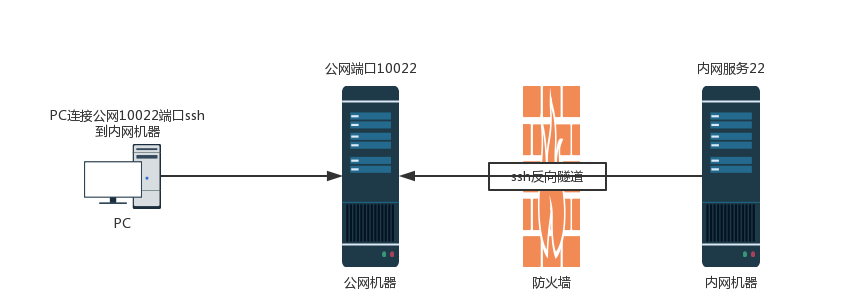

## 角色

 - 内网机器：A ip地址192.168.1.187

 - 公网机器：B 地址pan.cloudhua.com

 - PC机器：使用B机器模拟

## 操作步骤

1. 登录内网机器A

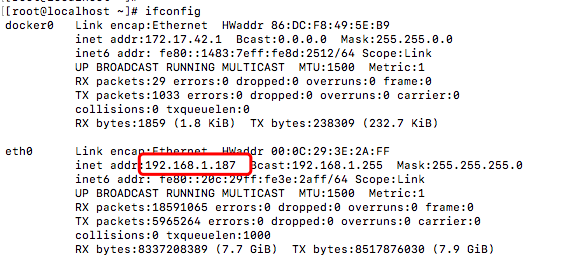

2. 在A机器上执行命令搭建反向隧道
ssh -p 10422 -fgnNTR 11122:0.0.0.0:22 root@pan.cloudhua.com

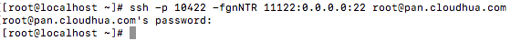

3. 登录B机器查看端口占用，11122隧道搭建成功。

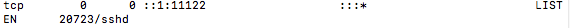

4. B机器上通过11122登录内网机器A，这里以B服务器当客户机连接内网A，将B服务器上的11122端口暴露出去这样能访问到B机器的客户机都能连接到内网A了

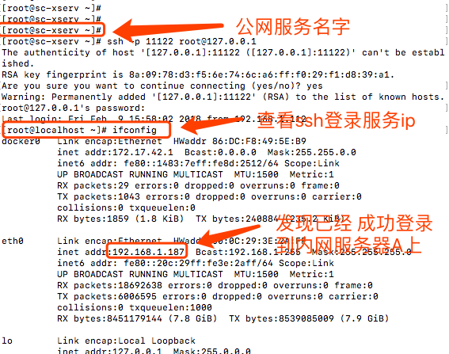

# 内网机器不能直接连接外网，通过内网能连接外网的跳转机搭建隧道

网络示意图

## 角色

 - 内网不能连接外网机器：A ip地址192.168.1.247

 - 内网可以连接外网跳转机：B ip地址192.168.1.187

 - 公网服务器：C 地址pan.cloudhua.com

 - PC客户机

## 操作步骤

### 从外网ssh远程到内网机器A方法

1. 在服务器B上搭建到公网机器A的反向隧道

ssh -p 10422 -fgnNTR 11122:127.0.0.1:22 root@pan.cloudhua.com

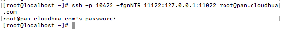

2. 登录公网服务器C查看端口状态，隧道搭建成功

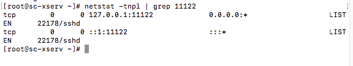

3. 使用C机器模拟PC客户机登录内网跳转机后在登录内网机器

### 从外网访问内网服务器A上80端口的服务

1. 登录服务器A搭建到B的反向隧道暴露80端口

ssh -fgnNTR 11080:0.0.0.0:80 root@192.168.1.187

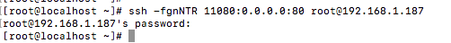

2. 登录内网跳转机B，搭建到公网机器C的反向隧道暴露11080端口

ssh -p 10422 -fgnNTR 11180:127.0.0.1:11080 root@pan.cloudhua.com

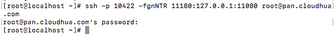

3. 登录公网机器C模拟客户端尝试访问11180端口服务，远端的nginx服务返回一个重定向的指令，说明已经连接到内网的服务器了。

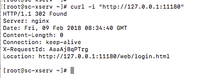

# 内网机器不能直接连接外网，通过windows跳转机搭建隧道

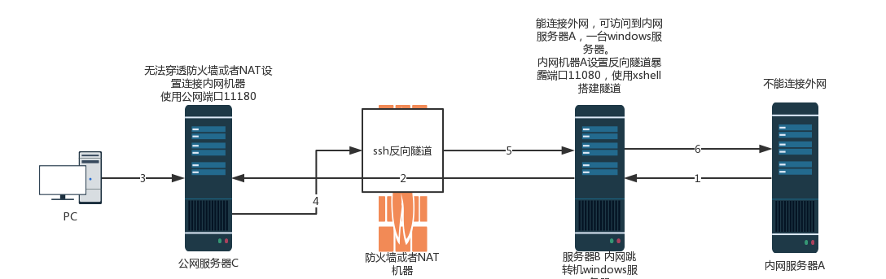

## 角色

 - 内网服务器：A ip地址192.168.1.247

 - 内网windows跳转机：B ip地址192.168.1.70

 - 公网服务器：C 地址pan.cloudhua.com

 - PC客户机

## 操作步骤

内网服务器A是一台linux服务器无法连接外网，跳转服务器B是一台windows server可以连接外网，服务器C是一台公网服务器，先PC客户机向直接访问到内网服务器A上面的一个服务。

在跳转机B上使用xshell开通隧道，使用其他相关的远程连接工具如putty也能实现相同目的。

1. 在windows服务器上安装xshell，创建到A服务器的连接并添加本地端口转发规则：

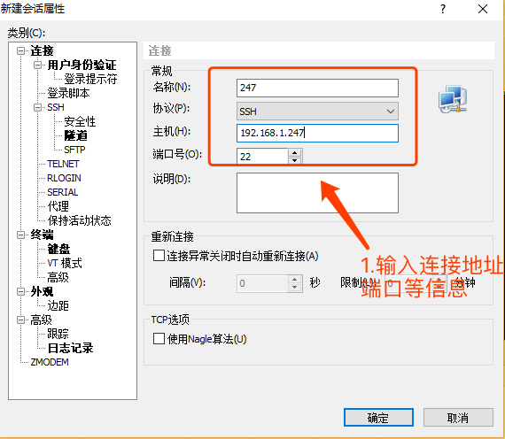

输入相关连接地址后选择隧道选项，添加转发规则。

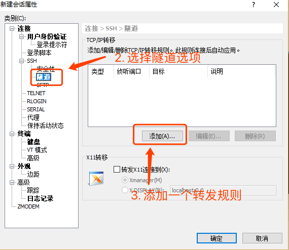

这里需要将windows跳转机B本机的11080端口转发到内网机器A的80端口上

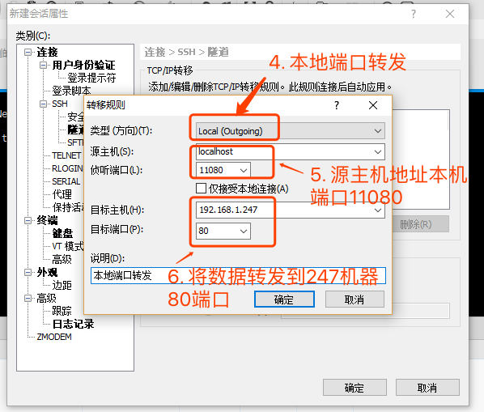

点击确定后完成连接内网服务器A的设置，点击连接，输入账号密码后完成连接。

点击菜单栏“查看”，勾选“隧道窗格”后在下方显示当前连接的隧道信息，选择“转发规则”可看到刚才配置的本地端口转发信息与状态，如果状态不是打开有能是端口占用导致失败。

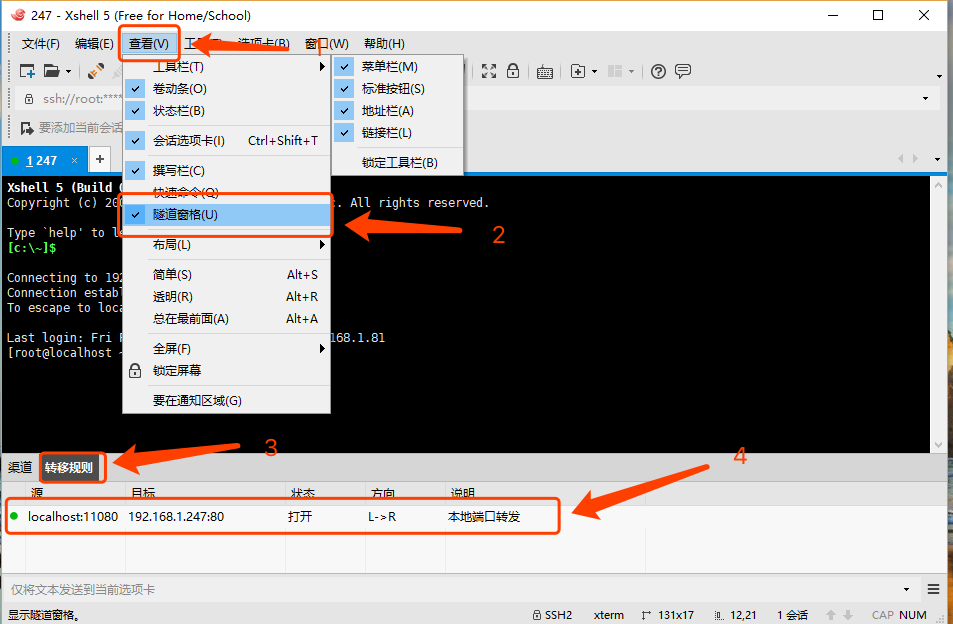

2. 创建到公网C服务器的连接并添加远端端口转发规则：

添加好连接信息之后同上一步操作进入“隧道”选项，添加规则：

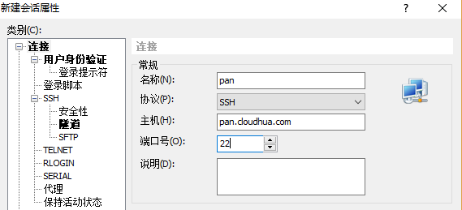

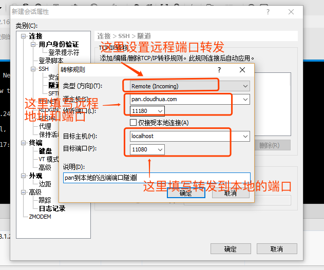

点击完成并连接后检查转发规则中是否正常：

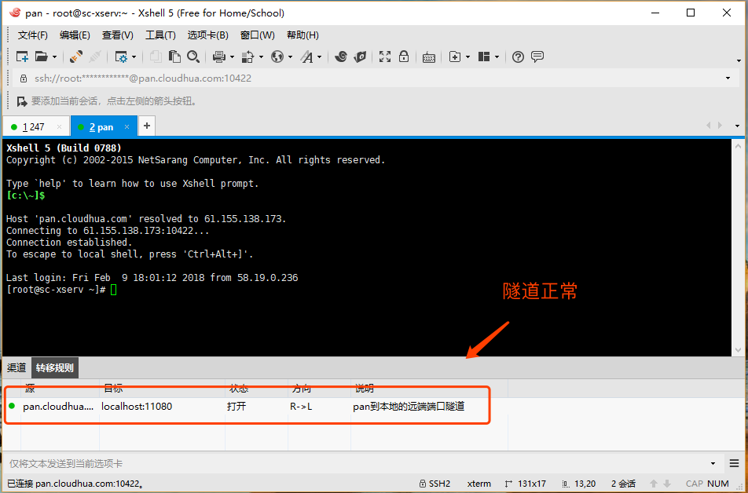

4. PC客户机创建本地8888端口到公网服务器的11180转发规则：

ssh -p 10422 -L 8888:127.0.0.1:11180 root@pan.cloudhua.com

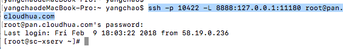

5. 测试访问本地8888端口即可转发到内网服务器A的服务

## 数据流向

PC客户机8888 --》公网服务器C11180 --》 内网windows服务器B11080 --》 内网服务器A80

# 总结

以上举出了几种常见的端口转发使用示例，当然生产测试环境中的环境不仅仅这三种，通过ssh本地端口转发和远程端口转发可以实现大多数情况下的联通网络，不同环境自行组合使用。