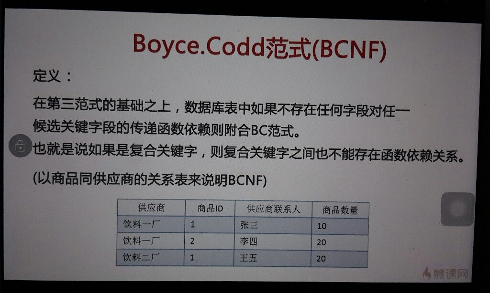

范式
第一范式

所有字段都是单一属性不可再分，第一范式要求数据库中的表都是二维表

第二范式

数据库表中不存在非关键字段对任一候选关键字段的部分依赖。

简单的来说就是，单关键字也就是一个字段是主键的肯定满足第二范式，

要是组合关键字也就是两个或者两个以上字段为主键，则需要其他非主键的关键字必须同时依赖主键不能依赖主键的部分关键字！

下图中表就不符合第二范式！仔细观看

第三范式

第三范式在第二范式的基础之上建立，如果数据表中不存在非关键字段对任意关键字段的传递函数依赖则符合第三范式。

简单是说就是，其他非关键字非主键的字段必须直接依赖候选关键字也就是直接依赖于主键！

BC范式

在第三范式基础上，数据库表中不存在任何字段对任一候选关键字也就是主键的传递函数依赖则符合BC范式。

总结

1NF:字段不可分; 

2NF:有主键，非主键字段依赖主键; 

3NF:非主键字段不能相互依赖; 

解释: 

1NF:原子性 字段不可再分,否则就不是关系数据库; 

2NF:唯一性 一个表只说明一个事物; 

3NF:每列都与主键有直接关系，不存在传递依赖; 

不符合第一范式的例子(关系数据库中create不出这样的表)： 

表:字段1, 字段2(字段2.1, 字段2.2), 字段3 ...... 

存在的问题: 因为设计不出这样的表, 所以没有问题; 

不符合第二范式的例子: 

表:学号, 姓名, 年龄, 课程名称, 成绩, 学分; 

这个表明显说明了两个事务:学生信息, 课程信息; 

存在问题: 

数据冗余，每条记录都含有相同信息； 

删除异常：删除所有学生成绩，就把课程信息全删除了； 

插入异常：学生未选课，无法记录进数据库； 

更新异常：调整课程学分，所有行都调整。 

修正: 

学生：Student(学号, 姓名, 年龄)； 

课程：Course(课程名称, 学分)； 

选课关系：SelectCourse(学号, 课程名称, 成绩)。 

满足第2范式只消除了插入异常。 

不符合第三范式的例子: 

学号, 姓名, 年龄, 所在学院, 学院联系电话，关键字为单一关键字"学号"; 

存在依赖传递: (学号) → (所在学院) → (学院地点, 学院电话) 

存在问题: 

数据冗余:有重复值； 

更新异常：有重复的冗余信息，修改时需要同时修改多条记录，否则会出现数据不一致的情况 

删除异常 

修正： 

学生：(学号, 姓名, 年龄, 所在学院)； 

学院：(学院, 地点, 电话)。 