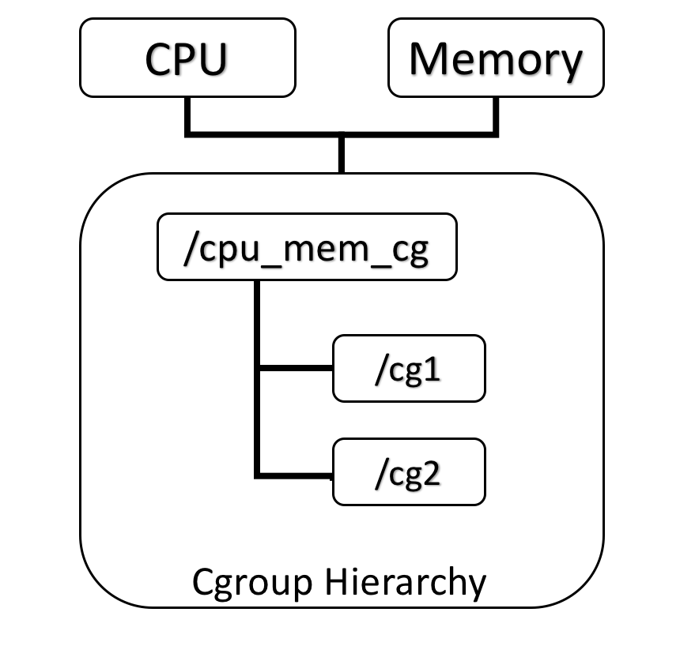
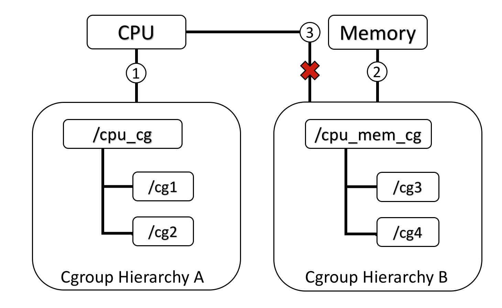
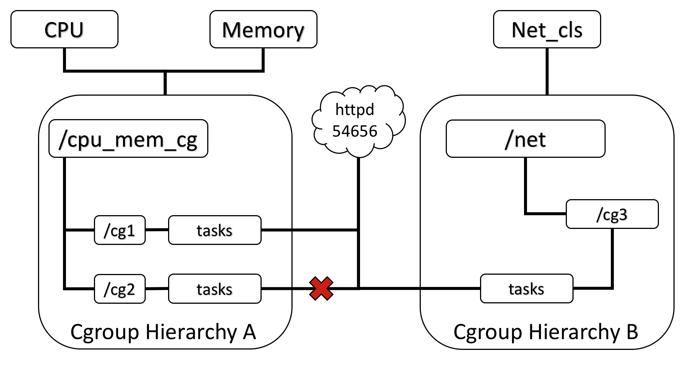
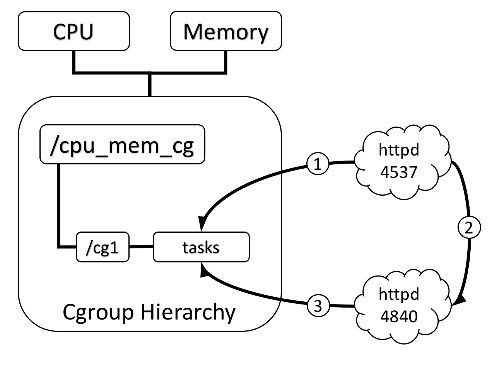
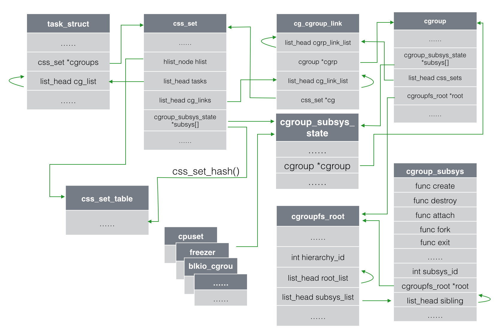
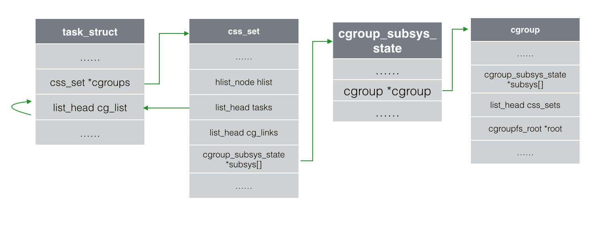
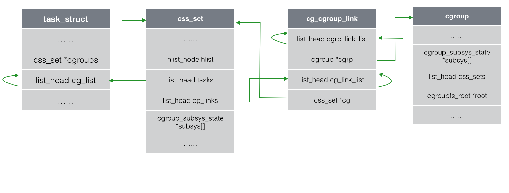
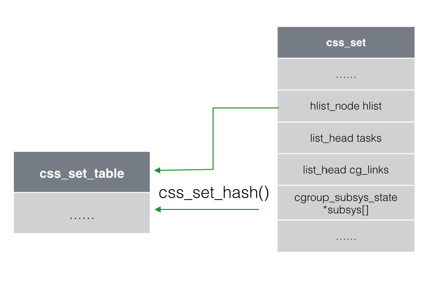
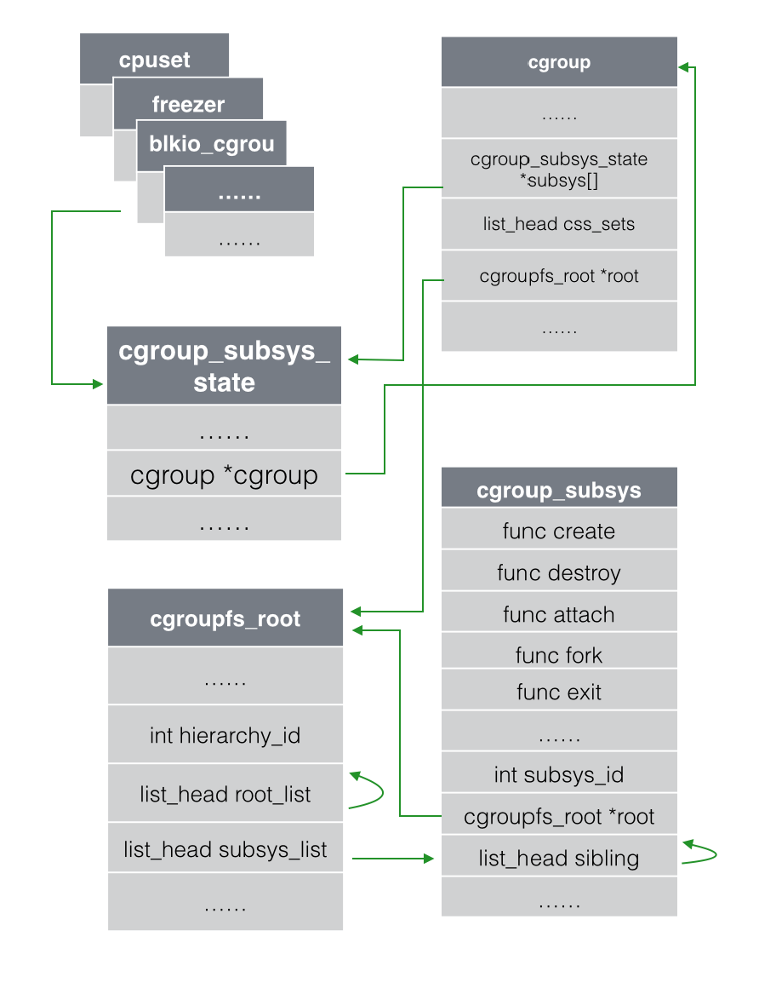

## 1. cgroups是什么

cgroups（Control Groups）最初叫Process Container，由Google工程师（Paul Menage和Rohit Seth）于2006年提出，后来因为Container有多重含义容易引起误解，就在2007年更名为Control Groups，并被整合进Linux内核。顾名思义就是把进程放到一个组里面统一加以控制。官方的定义如下{![引自：https://www.kernel.org/doc/Documentation/cgroups/cgroups.txt]}。

> cgroups是Linux内核提供的一种机制，这种机制可以根据特定的行为，把一系列系统任务及其子任务整合（或分隔）到按资源划分等级的不同组内，从而为系统资源管理提供一个统一的框架。

相关厂商内容

### [Twitter Messaging的架构演化之路](http://www.infoq.com/infoq/url.action?i=8960&t=f)

### [业务核心架构，根据业务需求设计合理架构](http://www.infoq.com/infoq/url.action?i=8961&t=f)

### [QCon北京2016大会，4月21-23日，与您相约北京国际会议中心，2月21前报名享8折优惠！](http://www.infoq.com/infoq/url.action?i=8962&t=f)

相关赞助商

QCon北京2016大会，4月21-23日，北京·国际会议中心，[精彩内容](http://www.infoq.com/infoq/url.action?i=8963&t=f)邀您参与！

通俗的来说，cgroups可以限制、记录、隔离进程组所使用的物理资源（包括：CPU、memory、IO等），为容器实现虚拟化提供了基本保证，是构建Docker等一系列虚拟化管理工具的基石。

对开发者来说，cgroups有如下四个有趣的特点：

- cgroups的API以一个伪文件系统的方式实现，即用户可以通过文件操作实现cgroups的组织管理。
- cgroups的组织管理操作单元可以细粒度到线程级别，用户态代码也可以针对系统分配的资源创建和销毁cgroups，从而实现资源再分配和管理。
- 所有资源管理的功能都以“subsystem（子系统）”的方式实现，接口统一。
- 子进程创建之初与其父进程处于同一个cgroups的控制组。

本质上来说，cgroups是内核附加在程序上的一系列钩子（hooks），通过程序运行时对资源的调度触发相应的钩子以达到资源追踪和限制的目的。

## 2. cgroups的作用

实现cgroups的主要目的是为不同用户层面的资源管理，提供一个统一化的接口。从单个进程的资源控制到操作系统层面的虚拟化。Cgroups提供了以下四大功能{![参照自：http://en.wikipedia.org/wiki/Cgroups]}。

- 资源限制（Resource Limitation）：cgroups可以对进程组使用的资源总额进行限制。如设定应用运行时使用内存的上限，一旦超过这个配额就发出OOM（Out of Memory）。
- 优先级分配（Prioritization）：通过分配的CPU时间片数量及硬盘IO带宽大小，实际上就相当于控制了进程运行的优先级。
- 资源统计（Accounting）： cgroups可以统计系统的资源使用量，如CPU使用时长、内存用量等等，这个功能非常适用于计费。
- 进程控制（Control）：cgroups可以对进程组执行挂起、恢复等操作。

过去有一段时间，内核开发者甚至把namespace也作为一个cgroups的subsystem加入进来，也就是说cgroups曾经甚至还包含了资源隔离的能力。但是资源隔离会给cgroups带来许多问题，如PID在循环出现的时候cgroup却出现了命名冲突、cgroup创建后进入新的namespace导致脱离了控制等等{![详见：https://git.kernel.org/cgit/linux/kernel/git/torvalds/linux.git/commit/?id=a77aea92010acf54ad785047234418d5d68772e2]}，所以在2011年就被移除了。

## 3. 术语表

- **task（任务）**：cgroups的术语中，task就表示系统的一个进程。
- **cgroup（控制组）**：cgroups 中的资源控制都以cgroup为单位实现。cgroup表示按某种资源控制标准划分而成的任务组，包含一个或多个子系统。一个任务可以加入某个cgroup，也可以从某个cgroup迁移到另外一个cgroup。
- **subsystem（子系统）**：cgroups中的subsystem就是一个资源调度控制器（Resource Controller）。比如CPU子系统可以控制CPU时间分配，内存子系统可以限制cgroup内存使用量。
- **hierarchy（层级树）**：hierarchy由一系列cgroup以一个树状结构排列而成，每个hierarchy通过绑定对应的subsystem进行资源调度。hierarchy中的cgroup节点可以包含零或多个子节点，子节点继承父节点的属性。整个系统可以有多个hierarchy。

## 4. 组织结构与基本规则

大家在namespace技术的讲解中已经了解到，传统的Unix进程管理，实际上是先启动`init`进程作为根节点，再由`init`节点创建子进程作为子节点，而每个子节点由可以创建新的子节点，如此往复，形成一个树状结构。而cgroups也是类似的树状结构，子节点都从父节点继承属性。

它们最大的不同在于，系统中cgroup构成的hierarchy可以允许存在多个。如果进程模型是由`init`作为根节点构成的一棵树的话，那么cgroups的模型则是由多个hierarchy构成的森林。这样做的目的也很好理解，如果只有一个hierarchy，那么所有的task都要受到绑定其上的subsystem的限制，会给那些不需要这些限制的task造成麻烦。

了解了cgroups的组织结构，我们再来了解cgroup、task、subsystem以及hierarchy四者间的相互关系及其基本规则{![参照自：https://access.redhat.com/documentation/en-US/Red*Hat*Enterprise*Linux/6/html/Resource*Management*Guide/sec-Relationships*Between*Subsystems*Hierarchies*Control*Groups*and*Tasks.html]}。

- 
**规则1：** 同一个hierarchy可以附加一个或多个subsystem。如下图1，cpu和memory的subsystem附加到了一个hierarchy。

**图1 同一个hierarchy可以附加一个或多个subsystem**

- 
**规则2：** 一个subsystem可以附加到多个hierarchy，当且仅当这些hierarchy只有这唯一一个subsystem。如下图2，小圈中的数字表示subsystem附加的时间顺序，CPU subsystem附加到hierarchy A的同时不能再附加到hierarchy B，因为hierarchy B已经附加了memory subsystem。如果hierarchy B与hierarchy A状态相同，没有附加过memory subsystem，那么CPU subsystem同时附加到两个hierarchy是可以的。

**图2 一个已经附加在某个hierarchy上的subsystem不能附加到其他含有别的subsystem的hierarchy上**

- 
**规则3：** 系统每次新建一个hierarchy时，该系统上的所有task默认构成了这个新建的hierarchy的初始化cgroup，这个cgroup也称为root cgroup。对于你创建的每个hierarchy，task只能存在于其中一个cgroup中，即一个task不能存在于同一个hierarchy的不同cgroup中，但是一个task可以存在在不同hierarchy中的多个cgroup中。如果操作时把一个task添加到同一个hierarchy中的另一个cgroup中，则会从第一个cgroup中移除。在下图3中可以看到，`httpd`进程已经加入到hierarchy A中的`/cg1`而不能加入同一个hierarchy中的`/cg2`，但是可以加入hierarchy B中的`/cg3`。实际上不允许加入同一个hierarchy中的其他cgroup野生为了防止出现矛盾，如CPU subsystem为`/cg1`分配了30%，而为`/cg2`分配了50%，此时如果`httpd`在这两个cgroup中，就会出现矛盾。

**图3 一个task不能属于同一个hierarchy的不同cgroup**

- 
**规则4：** 进程（task）在fork自身时创建的子任务（child task）默认与原task在同一个cgroup中，但是child task允许被移动到不同的cgroup中。即fork完成后，父子进程间是完全独立的。如下图4中，小圈中的数字表示task 出现的时间顺序，当`httpd`刚fork出另一个`httpd`时，在同一个hierarchy中的同一个cgroup中。但是随后如果PID为4840的`httpd`需要移动到其他cgroup也是可以的，因为父子任务间已经独立。总结起来就是：初始化时子任务与父任务在同一个cgroup，但是这种关系随后可以改变。

**图4 刚fork出的子进程在初始状态与其父进程处于同一个cgroup**

## 5. subsystem简介

subsystem实际上就是cgroups的资源控制系统，每种subsystem独立地控制一种资源，目前Docker使用如下八种subsystem，还有一种`net_cls` subsystem在内核中已经广泛实现，但是Docker尚未使用。他们的用途分别如下。

- **blkio：** 这个subsystem可以为块设备设定输入/输出限制，比如物理驱动设备（包括磁盘、固态硬盘、USB等）。
- **cpu：** 这个subsystem使用调度程序控制task对CPU的使用。
- **cpuacct：** 这个subsystem自动生成cgroup中task对CPU资源使用情况的报告。
- **cpuset：** 这个subsystem可以为cgroup中的task分配独立的CPU（此处针对多处理器系统）和内存。
- **devices** 这个subsystem可以开启或关闭cgroup中task对设备的访问。
- **freezer** 这个subsystem可以挂起或恢复cgroup中的task。
- **memory** 这个subsystem可以设定cgroup中task对内存使用量的限定，并且自动生成这些task对内存资源使用情况的报告。
- **perf*event**** 这个subsystem使用后使得cgroup中的task可以进行统一的性能测试。{![perf: Linux CPU性能探测器，详见https://perf.wiki.kernel.org/index.php/Main*Page]}
- ***net_cls** 这个subsystem Docker没有直接使用，它通过使用等级识别符(classid)标记网络数据包，从而允许 Linux 流量控制程序（TC：Traffic Controller）识别从具体cgroup中生成的数据包。

## 6. cgroups实现方式及工作原理简介

### （1）cgroups实现结构讲解

cgroups的实现本质上是给系统进程挂上钩子（hooks），当task运行的过程中涉及到某个资源时就会触发钩子上所附带的subsystem进行检测，最终根据资源类别的不同使用对应的技术进行资源限制和优先级分配。那么这些钩子又是怎样附加到进程上的呢？下面我们将对照结构体的图表一步步分析，请放心，描述代码的内容并不多。

(点击放大图像)

**图5 cgroups相关结构体一览**

Linux中管理task进程的数据结构为`task_struct`（包含所有进程管理的信息），其中与cgroup相关的字段主要有两个，一个是`css_set *cgroups`，表示指向`css_set`（包含进程相关的cgroups信息）的指针，一个task只对应一个`css_set`结构，但是一个`css_set`可以被多个task使用。另一个字段是`list_head cg_list`，是一个链表的头指针，这个链表包含了所有的链到同一个`css_set`的task进程（在图中使用的回环箭头，均表示可以通过该字段找到所有同类结构，获得信息）。

每个`css_set`结构中都包含了一个指向`cgroup_subsys_state`（包含进程与一个特定子系统相关的信息）的指针数组。`cgroup_subsys_state`则指向了`cgroup`结构（包含一个cgroup的所有信息），通过这种方式间接的把一个进程和cgroup联系了起来，如下图6。

**图6 从task结构开始找到cgroup结构**

另一方面，`cgroup`结构体中有一个`list_head css_sets`字段，它是一个头指针，指向由`cg_cgroup_link`（包含cgroup与task之间多对多关系的信息，后文还会再解释）形成的链表。由此获得的每一个`cg_cgroup_link`都包含了一个指向`css_set *cg`字段，指向了每一个task的`css_set`。`css_set`结构中则包含`tasks`头指针，指向所有链到此`css_set`的task进程构成的链表。至此，我们就明白如何查看在同一个cgroup中的task有哪些了，如下图7。

**图7 cglink多对多双向查询**

细心的读者可能已经发现，`css_set`中也有指向所有`cg_cgroup_link`构成链表的头指针，通过这种方式也能定位到所有的cgroup，这种方式与图1中所示的方式得到的结果是相同的。

那么为什么要使用`cg_cgroup_link`结构体呢？因为task与cgroup之间是多对多的关系。熟悉数据库的读者很容易理解，在数据库中，如果两张表是多对多的关系，那么如果不加入第三张关系表，就必须为一个字段的不同添加许多行记录，导致大量冗余。通过从主表和副表各拿一个主键新建一张关系表，可以提高数据查询的灵活性和效率。

而一个task可能处于不同的cgroup，只要这些cgroup在不同的hierarchy中，并且每个hierarchy挂载的子系统不同；另一方面，一个cgroup中可以有多个task，这是显而易见的，但是这些task因为可能还存在在别的cgroup中，所以它们对应的`css_set`也不尽相同，所以一个cgroup也可以对应多个·`css_set`。

在系统运行之初，内核的主函数就会对`root cgroups`和`css_set`进行初始化，每次task进行fork/exit时，都会附加（attach）/分离（detach）对应的`css_set`。

综上所述，添加`cg_cgroup_link`主要是出于性能方面的考虑，一是节省了`task_struct`结构体占用的内存，二是提升了进程`fork()/exit()`的速度。

**图8 css_set与hashtable关系**

当task从一个cgroup中移动到另一个时，它会得到一个新的`css_set`指针。如果所要加入的cgroup与现有的cgroup子系统相同，那么就重复使用现有的`css_set`，否则就分配一个新`css_set`。所有的`css_set`通过一个哈希表进行存放和查询，如上图8中所示，`hlist_node hlist`就指向了`css_set_table`这个hash表。

同时，为了让cgroups便于用户理解和使用，也为了用精简的内核代码为cgroup提供熟悉的权限和命名空间管理，内核开发者们按照Linux 虚拟文件系统转换器（VFS：Virtual Filesystem Switch）的接口实现了一套名为`cgroup`的文件系统，非常巧妙地用来表示cgroups的hierarchy概念，把各个subsystem的实现都封装到文件系统的各项操作中。有兴趣的读者可以在网上搜索并阅读[VFS](http://en.wikipedia.org/wiki/Virtual_file_system)的相关内容，在此就不赘述了。

定义子系统的结构体是`cgroup_subsys`，在图9中可以看到，`cgroup_subsys`中定义了一组函数的接口，让各个子系统自己去实现，类似的思想还被用在了`cgroup_subsys_state`中，`cgroup_subsys_state`并没有定义控制信息，只是定义了各个子系统都需要用到的公共信息，由各个子系统各自按需去定义自己的控制信息结构体，最终在自定义的结构体中把`cgroup_subsys_state`包含进去，然后内核通过`container_of`（这个宏可以通过一个结构体的成员找到结构体自身）等宏定义来获取对应的结构体。

**图9 cgroup子系统结构体**

### （2）基于cgroups实现结构的用户层体现

了解了cgroups实现的代码结构以后，再来看用户层在使用cgroups时的限制，会更加清晰。

在实际的使用过程中，你需要通过挂载（mount）`cgroup`文件系统新建一个层级结构，挂载时指定要绑定的子系统，缺省情况下默认绑定系统所有子系统。把cgroup文件系统挂载（mount）上以后，你就可以像操作文件一样对cgroups的hierarchy层级进行浏览和操作管理（包括权限管理、子文件管理等等）。除了cgroup文件系统以外，内核没有为cgroups的访问和操作添加任何系统调用。

如果新建的层级结构要绑定的子系统与目前已经存在的层级结构完全相同，那么新的挂载会重用原来已经存在的那一套（指向相同的css_set）。否则如果要绑定的子系统已经被别的层级绑定，就会返回挂载失败的错误。如果一切顺利，挂载完成后层级就被激活并与相应子系统关联起来，可以开始使用了。

目前无法将一个新的子系统绑定到激活的层级上，或者从一个激活的层级中解除某个子系统的绑定。

当一个顶层的cgroup文件系统被卸载（umount）时，如果其中创建后代cgroup目录，那么就算上层的cgroup被卸载了，层级也是激活状态，其后代cgoup中的配置依旧有效。只有递归式的卸载层级中的所有cgoup，那个层级才会被真正删除。

层级激活后，`/proc`目录下的每个task PID文件夹下都会新添加一个名为`cgroup`的文件，列出task所在的层级，对其进行控制的子系统及对应cgroup文件系统的路径。

一个cgroup创建完成，不管绑定了何种子系统，其目录下都会生成以下几个文件，用来描述cgroup的相应信息。同样，把相应信息写入这些配置文件就可以生效，内容如下。

- `tasks`：这个文件中罗列了所有在该cgroup中task的PID。该文件并不保证task的PID有序，把一个task的PID写到这个文件中就意味着把这个task加入这个cgroup中。
- `cgroup.procs`：这个文件罗列所有在该cgroup中的线程组ID。该文件并不保证线程组ID有序和无重复。写一个线程组ID到这个文件就意味着把这个组中所有的线程加到这个cgroup中。
- `notify_on_release`：填0或1，表示是否在cgroup中最后一个task退出时通知运行`release agent`，默认情况下是0，表示不运行。
- `release_agent`：指定release agent执行脚本的文件路径（该文件在最顶层cgroup目录中存在），在这个脚本通常用于自动化`umount`无用的cgroup。

除了上述几个通用的文件以外，绑定特定子系统的目录下也会有其他的文件进行子系统的参数配置。

在创建的hierarchy中创建文件夹，就类似于fork中一个后代cgroup，后代cgroup中默认继承原有cgroup中的配置属性，但是你可以根据需求对配置参数进行调整。这样就把一个大的cgroup系统分割成一个个嵌套的、可动态变化的“软分区”。

## 7. cgroups的使用方法简介

### （1）安装cgroups工具库

本节主要针对Ubuntu14.04版本系统进行介绍，其他Linux发行版命令略有不同，原理是一样的。不安装cgroups工具库也可以使用cgroups，安装它只是为了更方便的在用户态对cgroups进行管理，同时也方便初学者理解和使用，本节对cgroups的操作和使用都基于这个工具库。

    apt-get install cgroup-bin

安装的过程会自动创建`/cgroup`目录，如果没有自动创建也不用担心，使用 `mkdir /cgroup` 手动创建即可。在这个目录下你就可以挂载各类子系统。安装完成后，你就可以使用`lssubsys`（罗列所有的subsystem挂载情况）等命令。

说明：也许你在其他文章中看到的cgroups工具库教程，会在/etc目录下生成一些初始化脚本和配置文件，默认的cgroup配置文件为`/etc/cgconfig.conf`，但是因为存在使LXC无法运行的bug，所以在新版本中把这个配置移除了，详见：https://bugs.launchpad.net/ubuntu/+source/libcgroup/+bug/1096771。

### （2）查询cgroup及子系统挂载状态

在挂载子系统之前，可能你要先检查下目前子系统的挂载状态，如果子系统已经挂载，根据第4节中讲的规则2，你就无法把子系统挂载到新的hierarchy，此时就需要先删除相应hierarchy或卸载对应子系统后再挂载。

- 查看所有的cgroup：`lscgroup`
- 查看所有支持的子系统：`lssubsys -a`
- 查看所有子系统挂载的位置： `lssubsys –m`
- 查看单个子系统（如memory）挂载位置：`lssubsys –m memory`

### （3）创建hierarchy层级并挂载子系统

在组织结构与规则一节中我们提到了hierarchy层级和subsystem子系统的关系，我们知道使用cgroup的最佳方式是：为想要管理的每个或每组资源创建单独的cgroup层级结构。而创建hierarchy并不神秘，实际上就是做一个标记，通过挂载一个tmpfs{![基于内存的临时文件系统，详见：http://en.wikipedia.org/wiki/Tmpfs]}文件系统，并给一个好的名字就可以了，系统默认挂载的cgroup就会进行如下操作。

    mount -t tmpfs cgroups /sys/fs/cgroup

其中`-t`即指定挂载的文件系统类型，其后的`cgroups`是会出现在`mount`展示的结果中用于标识，可以选择一个有用的名字命名，最后的目录则表示文件的挂载点位置。

挂载完成`tmpfs`后就可以通过`mkdir`命令创建相应的文件夹。

    mkdir /sys/fs/cgroup/cg1

再把子系统挂载到相应层级上，挂载子系统也使用mount命令，语法如下。

    mount -t cgroup -o subsystems name /cgroup/name

其​​​中​​​ subsystems 是​​​使​​​用​​​`,`（逗号）​​​分​​​开​​​的​​​子​​​系​​​统​​​列​​​表，name 是​​​层​​​级​​​名​​​称​​​。具体我们以挂载cpu和memory的子系统为例，命令如下。

    mount –t cgroup –o cpu,memory cpu_and_mem /sys/fs/cgroup/cg1

从`mount`命令开始，`-t`后面跟的是挂载的文件系统类型，即`cgroup`文件系统。`-o`后面跟要挂载的子系统种类如`cpu`、`memory`，用逗号隔开，其后的`cpu_and_mem`不被cgroup代码的解释，但会出现在/proc/mounts里，可以使用任何有用的标识字符串。最后的参数则表示挂载点的目录位置。

说明：如果挂载时提示`mount: agent already mounted or /cgroup busy`，则表示子系统已经挂载，需要先卸载原先的挂载点，通过第二条中描述的命令可以定位挂载点。

### （4）卸载cgroup

目前`cgroup`文件系统虽然支持重新挂载，但是官方不建议使用，重新挂载虽然可以改变绑定的子系统和`release agent`，但是它要求对应的hierarchy是空的并且release_agent会被传统的`fsnotify`（内核默认的文件系统通知）代替，这就导致重新挂载很难生效，未来重新挂载的功能可能会移除。你可以通过卸载，再挂载的方式处理这样的需求。

卸载cgroup非常简单，你可以通过`cgdelete`命令，也可以通过`rmdir`，以刚挂载的cg1为例，命令如下。

    rmdir /sys/fs/cgroup/cg1

rmdir执行成功的必要条件是cg1下层没有创建其它cgroup，cg1中没有添加任何task，并且它也没有被别的cgroup所引用。

cgdelete cpu,memory:/ 使用`cgdelete`命令可以递归的删除cgroup及其命令下的后代cgroup，并且如果cgroup中有task，那么task会自动移到上一层没有被删除的cgroup中，如果所有的cgroup都被删除了，那task就不被cgroups控制。但是一旦再次创建一个新的cgroup，所有进程都会被放进新的cgroup中。

### （5）设置cgroups参数

设置cgroups参数非常简单，直接对之前创建的cgroup对应文件夹下的文件写入即可，举例如下。

- 设置task允许使用的cpu为0和1. `echo 0-1 > /sys/fs/cgroup/cg1/cpuset.cpus`

使用`cgset`命令也可以进行参数设置，对应上述允许使用0和1cpu的命令为：

    cgset -r cpuset.cpus=0-1 cpu,memory:/

### （6）添加task到cgroup

- 
通过文件操作进行添加 `echo [PID] > /path/to/cgroup/tasks` 上述命令就是把进程ID打印到tasks中，如果tasks文件中已经有进程，需要使用`">>"`向后添加。

- 
通过`cgclassify`将进程添加到cgroup `cgclassify -g subsystems:path_to_cgroup pidlist` 这个命令中，`subsystems`指的就是子系统（如果使用man命令查看，可能也会使用controllers表示）​​​，如果mount了多个，就是用`","`隔开的子系统名字作为名称，类似`cgset`命令。

- 
通过`cgexec`直接在cgroup中启动并执行进程 `cgexec -g subsystems:path_to_cgroup command arguments` `command`和`arguments`就表示要在cgroup中执行的命令和参数。`cgexec`常用于执行临时的任务。

### （7）权限管理

与文件的权限管理类似，通过`chown`就可以对cgroup文件系统进行权限管理。

    chown uid:gid /path/to/cgroup

uid和gid分别表示所属的用户和用户组。

## 8. subsystem配置参数用法

### （1）blkio - BLOCK IO资源控制

- 
**限额类** 限额类是主要有两种策略，一种是基于完全公平队列调度（CFQ：Completely Fair Queuing ）的按权重分配各个cgroup所能占用总体资源的百分比，好处是当资源空闲时可以充分利用，但只能用于最底层节点cgroup的配置；另一种则是设定资源使用上限，这种限额在各个层次的cgroup都可以配置，但这种限制较为生硬，并且容器之间依然会出现资源的竞争。

- **按比例分配块设备IO资源**
- **blkio.weight**：填写100-1000的一个整数值，作为相对权重比率，作为通用的设备分配比。
- **blkio.weight_device**： 针对特定设备的权重比，写入格式为`device_types:node_numbers weight`，空格前的参数段指定设备，`weight`参数与`blkio.weight`相同并覆盖原有的通用分配比。{![查看一个设备的`device_types:node_numbers`可以使用：`ls -l /dev/DEV`，看到的用逗号分隔的两个数字就是。有的文章也称之为`major_number:minor_number`。]}
- **控制IO读写速度上限**
1. **blkio.throttle.read_bps_device**：按每秒读取块设备的数据量设定上限，格式`device_types:node_numbers bytes_per_second`。
2. **blkio.throttle.write_bps_device**：按每秒写入块设备的数据量设定上限，格式`device_types:node_numbers bytes_per_second`。
3. **blkio.throttle.read_iops_device**：按每秒读操作次数设定上限，格式`device_types:node_numbers operations_per_second`。
4. **blkio.throttle.write_iops_device**：按每秒写操作次数设定上限，格式`device_types:node_numbers operations_per_second`

- **针对特定操作(read, write, sync, 或async)设定读写速度上限**
1. **blkio.throttle.io_serviced**：针对特定操作按每秒操作次数设定上限，格式`device_types:node_numbers operation operations_per_second`
2. **blkio.throttle.io_service_bytes**：针对特定操作按每秒数据量设定上限，格式`device_types:node_numbers operation bytes_per_second`

- 
**统计与监控** 以下内容都是只读的状态报告，通过这些统计项更好地统计、监控进程的 io 情况。

1. **blkio.reset_stats**：重置统计信息，写入一个int值即可。
2. **blkio.time**：统计cgroup对设备的访问时间，按格式`device_types:node_numbers milliseconds`读取信息即可，以下类似。
3. **blkio.io_serviced**：统计cgroup对特定设备的IO操作（包括read、write、sync及async）次数，格式`device_types:node_numbers operation number`
4. **blkio.sectors**：统计cgroup对设备扇区访问次数，格式`device_types:node_numbers sector_count`
5. **blkio.io_service_bytes**：统计cgroup对特定设备IO操作（包括read、write、sync及async）的数据量，格式`device_types:node_numbers operation bytes`
6. **blkio.io_queued**：统计cgroup的队列中对IO操作（包括read、write、sync及async）的请求次数，格式`number operation`
7. **blkio.io_service_time**：统计cgroup对特定设备的IO操作（包括read、write、sync及async）时间(单位为ns)，格式`device_types:node_numbers operation time`
8. **blkio.io_merged**：统计cgroup 将 BIOS 请求合并到IO操作（包括read、write、sync及async）请求的次数，格式`number operation`
9. **blkio.io_wait_time**：统计cgroup在各设​​​备​​​中各类型​​​IO操作（包括read、write、sync及async）在队列中的等待时间​(单位ns)，格式`device_types:node_numbers operation time`
10. __blkio.__recursive_*：各类型的统计都有一个递归版本，Docker中使用的都是这个版本。获取的数据与非递归版本是一样的，但是包括cgroup所有层级的监控数据。

### （2） cpu - CPU资源控制

CPU资源的控制也有两种策略，一种是完全公平调度 （CFS：Completely Fair Scheduler）策略，提供了限额和按比例分配两种方式进行资源控制；另一种是实时调度（Real-Time Scheduler）策略，针对实时进程按周期分配固定的运行时间。配置时间都以微秒（µs）为单位，文件名中用`us`表示。

- 
**CFS调度策略下的配置**

- 设定CPU使用周期使用时间上限
- **cpu.cfs_period_us**：设定周期时间，必须与`cfs_quota_us`配合使用。
- **cpu.cfs_quota_us** ：设定周期内最多可使用的时间。这里的配置指task对单个cpu的使用上限，若`cfs_quota_us`是`cfs_period_us`的两倍，就表示在两个核上完全使用。数值范围为1000 - 1000,000（微秒）。
- **cpu.stat**：统计信息，包含`nr_periods`（表示经历了几个`cfs_period_us`周期）、`nr_throttled`（表示task被限制的次数）及`throttled_time`（表示task被限制的总时长）。
- **按权重比例设定CPU的分配**
- **cpu.shares**：设定一个整数（必须大于等于2）表示相对权重，最后除以权重总和算出相对比例，按比例分配CPU时间。（如cgroup A设置100，cgroup B设置300，那么cgroup A中的task运行25%的CPU时间。对于一个4核CPU的系统来说，cgroup A 中的task可以100%占有某一个CPU，这个比例是相对整体的一个值。）

- 
**RT调度策略下的配置** 实时调度策略与公平调度策略中的按周期分配时间的方法类似，也是在周期内分配一个固定的运行时间。

1. **cpu.rt_period_us** ：设定周期时间。
2. **cpu.rt_runtime_us**：设定周期中的运行时间。

### （3） cpuacct - CPU资源报告

这个子系统的配置是`cpu`子系统的补充，提供CPU资源用量的统计，时间单位都是纳秒。

1. **cpuacct.usage**：统计cgroup中所有task的cpu使用时长
2. **cpuacct.stat**：统计cgroup中所有task的用户态和内核态分别使用cpu的时长
3. **cpuacct.usage_percpu**：统计cgroup中所有task使用每个cpu的时长

### （4）cpuset - CPU绑定

为task分配独立CPU资源的子系统，参数较多，这里只选讲两个必须配置的参数，同时Docker中目前也只用到这两个。

1. **cpuset.cpus**：在这个文件中填写cgroup可使用的CPU编号，如`0-2,16`代表 0、1、2和16这4个CPU。
2. **cpuset.mems**：与CPU类似，表示cgroup可使用的`memory node`，格式同上

### （5） device - 限制task对device的使用

- **设备黑/白名单过滤 **
1. **devices.allow**：允许名单，语法`type device_types:node_numbers access type`；`type`有三种类型：b（块设备）、c（字符设备）、a（全部设备）；`access`也有三种方式：r（读）、w（写）、m（创建）。
2. **devices.deny**：禁止名单，语法格式同上。

- **统计报告**
1. **devices.list**：报​​​告​​​为​​​这​​​个​​​ cgroup 中​​​的​task设​​​定​​​访​​​问​​​控​​​制​​​的​​​设​​​备

### （6） freezer - 暂停/恢复cgroup中的task

只有一个属性，表示进程的状态，把task放到freezer所在的cgroup，再把state改为FROZEN，就可以暂停进程。不允许在cgroup处于FROZEN状态时加入进程。 * **freezer.state **，包括如下三种状态： - FROZEN 停止 - FREEZING 正在停止，这个是只读状态，不能写入这个值。 - THAWED 恢复

### （7） memory - 内存资源管理

- 
**限额类**

1. **memory.limit_bytes**：强制限制最大内存使用量，单位有`k`、`m`、`g`三种，填`-1`则代表无限制。
2. **memory.soft_limit_bytes**：软限制，只有比强制限制设置的值小时才有意义。填写格式同上。当整体内存紧张的情况下，task获取的内存就被限制在软限制额度之内，以保证不会有太多进程因内存挨饿。可以看到，加入了内存的资源限制并不代表没有资源竞争。
3. **memory.memsw.limit_bytes**：设定最大内存与swap区内存之和的用量限制。填写格式同上。

- 
**报警与自动控制**

1. **memory.oom_control**：改参数填0或1， `0`表示开启，当cgroup中的进程使用资源超过界限时立即杀死进程，`1`表示不启用。默认情况下，包含memory子系统的cgroup都启用。当`oom_control`不启用时，实际使用内存超过界限时进程会被暂停直到有空闲的内存资源。

- 
**统计与监控类**

1. **memory.usage_bytes**：报​​​告​​​该​​​ cgroup中​​​进​​​程​​​使​​​用​​​的​​​当​​​前​​​总​​​内​​​存​​​用​​​量（以字节为单位）
2. **memory.max_usage_bytes**：报​​​告​​​该​​​ cgroup 中​​​进​​​程​​​使​​​用​​​的​​​最​​​大​​​内​​​存​​​用​​​量
3. **memory.failcnt**：报​​​告​​​内​​​存​​​达​​​到​​​在​​`​ memory.limit_in_bytes`设​​​定​​​的​​​限​​​制​​​值​​​的​​​次​​​数​​​
4. **memory.stat**：包含大量的内存统计数据。
5. cache：页​​​缓​​​存​​​，包​​​括​​​ tmpfs（shmem），单位为字节。
6. rss：匿​​​名​​​和​​​ swap 缓​​​存​​​，不​​​包​​​括​​​ tmpfs（shmem），单位为字节。
7. mapped_file：memory-mapped 映​​​射​​​的​​​文​​​件​​​大​​​小​​​，包​​​括​​​ tmpfs（shmem），单​​​位​​​为​​​字​​​节​​​
8. pgpgin：存​​​入​​​内​​​存​​​中​​​的​​​页​​​数​​​
9. pgpgout：从​​​内​​​存​​​中​​​读​​​出​​​的​​​页​​​数
10. swap：swap 用​​​量​​​，单​​​位​​​为​​​字​​​节​​​
11. active_anon：在​​​活​​​跃​​​的​​​最​​​近​​​最​​​少​​​使​​​用​​​（least-recently-used，LRU）列​​​表​​​中​​​的​​​匿​​​名​​​和​​​ swap 缓​​​存​​​，包​​​括​​​ tmpfs（shmem），单​​​位​​​为​​​字​​​节​​​
12. inactive_anon：不​​​活​​​跃​​​的​​​ LRU 列​​​表​​​中​​​的​​​匿​​​名​​​和​​​ swap 缓​​​存​​​，包​​​括​​​ tmpfs（shmem），单​​​位​​​为​​​字​​​节
13. active_file：活​​​跃​​​ LRU 列​​​表​​​中​​​的​​​ file-backed 内​​​存​​​，以​​​字​​​节​​​为​​​单​​​位
14. inactive_file：不​​​活​​​跃​​​ LRU 列​​​表​​​中​​​的​​​ file-backed 内​​​存​​​，以​​​字​​​节​​​为​​​单​​​位
15. unevictable：无​​​法​​​再​​​生​​​的​​​内​​​存​​​，以​​​字​​​节​​​为​​​单​​​位​​​
16. hierarchical_memory_limit：包​​​含​​​ memory cgroup 的​​​层​​​级​​​的​​​内​​​存​​​限​​​制​​​，单​​​位​​​为​​​字​​​节​​​
17. hierarchical_memsw_limit：包​​​含​​​ memory cgroup 的​​​层​​​级​​​的​​​内​​​存​​​加​​​ swap 限​​​制​​​，单​​​位​​​为​​​字​​​节​​​

## 8. 总结

本文由浅入深的讲解了cgroups的方方面面，从cgroups是什么，到cgroups该怎么用，最后对大量的cgroup子系统配置参数进行了梳理。可以看到，内核对cgroups的支持已经较为完善，但是依旧有许多工作需要完善。如网络方面目前是通过TC（Traffic Controller）来控制，未来需要统一整合；资源限制并没有解决资源竞争，在各自限制之内的进程依旧存在资源竞争，优先级调度方面依旧有很大的改进空间。希望通过本文帮助大家了解cgroups，让更多人参与到社区的贡献中。