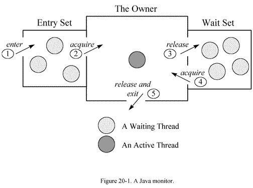

[TOC]

#JSTACK

摘自[http://blog.csdn.net/zhaozheng7758/article/details/8623535/](http://blog.csdn.net/zhaozheng7758/article/details/8623535/)

jstack用于打印出给定的[Java](http://lib.csdn.net/base/javaee)进程ID或core file或远程调试服务的Java堆栈信息，如果是在64位机器上，需要指定选项"-J-d64"，Windows的jstack使用方式只支持以下的这种方式：jstack [-l] pid

如果java程序崩溃生成core文件，jstack工具可以用来获得core文件的java stack和native stack的信息，从而可以轻松地知道java程序是如何崩溃和在程序何处发生问题。另外，jstack工具还可以附属到正在运行的java程序中，看到当时运行的java程序的java stack和native stack的信息, 如果现在运行的java程序呈现hung的状态，jstack是非常有用的。

需要注意的问题:

l 不同的 JAVA虚机的线程 DUMP的创建方法和文件格式是不一样的，不同的 JVM版本， dump信息也有差别。

l 在实际运行中，往往一次 dump的信息，还不足以确认问题。建议产生三次 dump信息，如果每次 dump都指向同一个问题，我们才确定问题的典型性。 

2、命令格式

$jstack [ option ] pid

$jstack [ option ] executable core

$jstack [ option ] [server-id@]remote-hostname-or-IP

参数说明:

pid: java应用程序的进程号,一般可以通过jps来获得;

executable:产生core dump的java可执行程序;

core:打印出的core文件;

remote-hostname-or-ip:远程debug服务器的名称或IP;

server-id: 唯一id,假如一台主机上多个远程debug服务;

 

示例:

$jstack –l 23561

 

线程分析:

一般情况下，通过jstack输出的线程信息主要包括：jvm自身线程、用户线程等。其中jvm线程会在jvm启动时就会存在。对于用户线程则是在用户访问时才会生成。

l jvm线程：

在线程中，有一些 JVM内部的后台线程，来执行譬如垃圾回收，或者低内存的检测等等任务，这些线程往往在JVM初始化的时候就存在，如下所示：

"Attach Listener" daemon prio=10 tid=0x0000000052fb8000 nid=0xb8f waiting on condition [0x0000000000000000]

   java.lang.Thread.State: RUNNABLE

 

   Locked ownable synchronizers:

        - None

destroyJavaVM" prio=10 tid=0x00002aaac1225800 nid=0x7208 waiting on condition [0x0000000000000000]

   java.lang.Thread.State: RUNNABLE

 

   Locked ownable synchronizers:

        - None

l 用户级别的线程

还有一类线程是用户级别的，它会根据用户请求的不同而发生变化。该类线程的运行情况往往是我们所关注的重点。而且这一部分也是最容易产生死锁的地方。

"qtp496432309-42" prio=10 tid=0x00002aaaba2a1800 nid=0x7580 waiting on condition [0x00000000425e9000]

   java.lang.Thread.State: TIMED_WAITING (parking)

        at sun.misc.Unsafe.park(Native Method)

        - parking to wait for  <0x0000000788cfb020> (a java.util.concurrent.locks.AbstractQueuedSynchronizer$ConditionObject)

        at java.util.concurrent.locks.LockSupport.parkNanos(LockSupport.java:198)

        at java.util.concurrent.locks.AbstractQueuedSynchronizer$ConditionObject.awaitNanos(AbstractQueuedSynchronizer.java:2025)

        at org.eclipse.jetty.util.BlockingArrayQueue.poll(BlockingArrayQueue.java:320)

        at org.eclipse.jetty.util.thread.QueuedThreadPool$2.run(QueuedThreadPool.java:479)

        at java.lang.Thread.run(Thread.java:662)

 

   Locked ownable synchronizers:

        - None

从上述的代码示例中我们可以看到该用户线程的以下几类信息：

Ø 线程的状态：waiting on condition(等待条件发生)

Ø 线程的调用情况；

Ø 线程对资源的锁定情况；

 

线程的状态分析：

正如我们刚看到的那样，线程的状态是一个重要的指标，它会显示在线程每行结尾的地方。那么线程常见的有哪些状态呢？线程在什么样的情况下会进入这种状态呢？我们能从中发现什么线索？

l **Runnable**

该状态表示线程具备所有运行条件，在运行队列中准备[操作系统](http://lib.csdn.net/base/operatingsystem)的调度，或者正在运行。 

l **Waiton condition **

该状态出现在线程等待某个条件的发生。具体是什么原因，可以结合stacktrace来分析。最常见的情况是线程在等待网络的读写，比如当网络数据没有准备好读时，线程处于这种等待状态，而一旦有数据准备好读之后，线程会重新激活，读取并处理数据。在 Java引入 NIO之前，对于每个网络连接，都有一个对应的线程来处理网络的读写操作，即使没有可读写的数据，线程仍然阻塞在读写操作上，这样有可能造成资源浪费，而且给操作系统的线程调度也带来压力。在 NIO里采用了新的机制，编写的服务器程序的性能和可扩展性都得到提高。 

如果发现有大量的线程都在处在 Wait on condition，从线程 stack看， 正等待网络读写，这可能是一个网络瓶颈的征兆。因为网络阻塞导致线程无法执行。一种情况是网络非常忙，几乎消耗了所有的带宽，仍然有大量数据等待网络读写；另一种情况也可能是网络空闲，但由于路由等问题，导致包无法正常的到达。所以要结合系统的一些性能观察工具来综合分析，比如 netstat统计单位时间的发送包的数目，如果很明显超过了所在网络带宽的限制 ; 观察 cpu的利用率，如果系统态的 CPU时间，相对于用户态的 CPU时间比例较高；如果程序运行在 Solaris 10平台上，可以用 dtrace工具看系统调用的情况，如果观察到 read/write的系统调用的次数或者运行时间遥遥领先；这些都指向由于网络带宽所限导致的网络瓶颈。 

另外一种出现 Wait on condition的常见情况是该线程在 sleep，等待 sleep的时间到了时候，将被唤醒。 

l **Waitingfor monitor entry 和 in Object.wait() **

在多线程的 JAVA程序中，实现线程之间的同步，就要说说Monitor。Monitor是Java中用以实现线程之间的互斥与协作的主要手段，它可以看成是对象或者 Class的锁。每一个对象都有，也仅有一个 monitor。下面这个图，描述了线程和 Monitor之间关系，以及线程的状态转换图： 

 

从图中可以看出，每个 Monitor在某个时刻，只能被一个线程拥有，该线程就是 “Active Thread”，而其它线程都是 “Waiting Thread”，分别在两个队列 “ Entry Set”和 “Wait Set”里面等候。在 “Entry Set”中等待的线程状态是 “Waiting for monitorentry”，而在 “Wait Set”中等待的线程状态是“in Object.wait()”。 

先看 “Entry Set”里面的线程。我们称被 synchronized保护起来的代码段为临界区。当一个线程申请进入临界区时，它就进入了 “Entry Set”队列。对应的 code就像： 

synchronized(obj){ 

......... 

} 

这时有两种可能性： 

该 monitor不被其它线程拥有，Entry Set里面也没有其它等待线程。本线程即成为相应类或者对象的 Monitor的 Owner，执行临界区的代码 。此时线程将处于Runnable状态；

该 monitor被其它线程拥有，本线程在 Entry Set队列中等待。此时dump的信息显示“waiting for monitor entry”。

"Thread-0" prio=10 tid=0x08222eb0 nid=0x9 waiting for monitor entry [0xf927b000..0xf927bdb8] 

at testthread.WaitThread.run(WaitThread.java:39) 
- waiting to lock <0xef63bf08> (a java.lang.Object) 
- locked <0xef63beb8> (a java.util.ArrayList) 
at java.lang.Thread.run(Thread.java:595) 

临界区的设置，是为了保证其内部的代码执行的原子性和完整性。但是因为临界区在任何时间只允许线程串行通过，这和我们多线程的程序的初衷是相反的。如果在多线程的程序中，大量使用 synchronized，或者不适当的使用了它，会造成大量线程在临界区的入口等待，造成系统的性能大幅下降。如果在线程 DUMP中发现了这个情况，应该审查源码，改进程序。 

现在我们再来看现在线程为什么会进入 “Wait Set”。当线程获得了 Monitor，进入了临界区之后，如果发现线程继续运行的条件没有满足，它则调用对象（一般就是被 synchronized 的对象）的 wait() 方法，放弃了 Monitor，进入 “Wait Set”队列。只有当别的线程在该对象上调用了 notify() 或者 notifyAll() ， “ Wait Set”队列中线程才得到机会去竞争，但是只有一个线程获得对象的Monitor，恢复到运行态。在 “Wait Set”中的线程， DUMP中表现为： in Object.wait()，类似于： 

"Thread-1" prio=10 tid=0x08223250 nid=0xa in Object.wait() [0xef47a000..0xef47aa38] 

at java.lang.Object.wait(Native Method) 

- waiting on <0xef63beb8> (a java.util.ArrayList) 

at java.lang.Object.wait(Object.java:474) 

at testthread.MyWaitThread.run(MyWaitThread.java:40) 

- locked <0xef63beb8> (a java.util.ArrayList) 

at java.lang.Thread.run(Thread.java:595) 

仔细观察上面的 DUMP信息，你会发现它有以下两行： 

² locked <0xef63beb8> (ajava.util.ArrayList) 

² waiting on <0xef63beb8> (ajava.util.ArrayList) 

这里需要解释一下，为什么先 lock了这个对象，然后又 waiting on同一个对象呢？让我们看看这个线程对应的代码： 

synchronized(obj){

......... 

obj.wait();

......... 

} 

线程的执行中，先用 synchronized 获得了这个对象的 Monitor（对应于 locked <0xef63beb8> ）。当执行到 obj.wait(), 线程即放弃了 Monitor的所有权，进入 “wait set”队列（对应于 waiting on<0xef63beb8> ）。 

往在你的程序中，会出现多个类似的线程，他们都有相似的 dump也可能是正常的。比如，在程序中有多个服务线程，设计成从一个队列里面读取请求数据。这个队列就是 lock以及 waiting on的对象。当队列为空的时候，这些线程都会在这个队列上等待，直到队列有了数据，这些线程被notify，当然只有一个线程获得了 lock，继续执行，而其它线程继续等待。 

java thread的运行周期中, 有几种状态, 在 java.lang.Thread.State 中有详细定义和说明:

**NEW **状态是指线程刚创建, 尚未启动

**RUNNABLE** 状态是线程正在正常运行中, 当然可能会有某种耗时计算/IO等待的操作/CPU时间片切换等, 这个状态下发生的等待一般是其他系统资源, 而不是锁, Sleep等

**BLOCKED ** 这个状态下, 是在多个线程有同步操作的场景, 比如正在等待另一个线程的synchronized 块的执行释放, 或者可重入的 synchronized块里别人调用wait() 方法, 也就是这里是线程在等待进入临界区

**WAITING ** 这个状态下是指线程拥有了某个锁之后, 调用了他的wait方法, 等待其他线程/锁拥有者调用 notify / notifyAll 一遍该线程可以继续下一步操作, 这里要区分 BLOCKED 和 WATING 的区别, 一个是在临界点外面等待进入, 一个是在理解点里面wait等待别人notify, 线程调用了join方法 join了另外的线程的时候, 也会进入WAITING状态, 等待被他join的线程执行结束

**TIMED_WAITING ** 这个状态就是有限的(时间限制)的WAITING, 一般出现在调用wait(long), join(long)等情况下, 另外一个线程sleep后, 也会进入TIMED_WAITING状态

**TERMINATED** 这个状态下表示 该线程的run方法已经执行完毕了, 基本上就等于死亡了(当时如果线程被持久持有, 可能不会被回收)

 

参考文献：

[http://www.blogjava.net/jzone/articles/303979.html](http://www.blogjava.net/jzone/articles/303979.html)

[http://blog.csdn.net/fenglibing/article/details/6411940](http://blog.csdn.net/fenglibing/article/details/6411940)

#常用JDK调试工具集合

[http://blog.csdn.net/fenglibing/article/details/6411940](http://blog.csdn.net/fenglibing/article/details/6411940)

#JMAP

摘自：http://blog.csdn.net/zhaozheng7758/article/details/8623530

1、命令基本概述

Jmap是一个可以输出所有内存中对象的工具，甚至可以将VM 中的heap，以二进制输出成文本。打印出某个[Java](http://lib.csdn.net/base/javaee)进程（使用pid）内存内的，所有‘对象’的情况（如：产生那些对象，及其数量）。

使用方法 jmap -histo pid。如果使用SHELL ,可采用jmap -histo pid>a.log日志将其保存到文件中，在一段时间后，使用文本对比工具，可以对比出GC回收了哪些对象。jmap -dump:format=b,file=outfile 3024可以将3024进程的内存heap输出出来到outfile文件里，再配合MAT（内存分析工具）。

64位机上使用需要使用如下方式：

jmap -J-d64 -heap pid

2、命令格式

l  jmap [ option ] pid

l  jmap [ option ] executable core

l  jmap [ option ] [server-id@]remote-hostname-or-IP

3、参数说明

1)、options： 

l  executable :产生core dump的java可执行程序;

l  core 将被打印信息的core dump文件;

l  remote-hostname-or-IP 远程debug服务的主机名或ip;

l  server-id 唯一id,假如一台主机上多个远程debug服务;

2）、基本参数：

Ø  -dump:[live,]format=b,file=<filename> 使用hprof二进制形式,输出jvm的heap内容到文件=. live子选项是可选的，假如指定live选项,那么只输出活的对象到文件. 

$jmap–dump:live,format=b,file=aaa.bin 3772

Ø  -finalizerinfo 打印正等候回收的对象的信息

$jmap -finalizerinfo 3772

Attaching to process ID 3772, please wait...

Debugger attached successfully.

Server compiler detected.

JVM version is 20.0-b11

Number of objects pending for finalization: 0 (等候回收的对象为0个)

Ø  -heap 打印heap的概要信息，GC使用的[算法](http://lib.csdn.net/base/datastructure)，heap的配置及wise heap的使用情况.

$jmap –heap 3772

using parallel threads in the new generation.  ##新生代采用的是并行线程处理方式

using thread-local object allocation.   

Concurrent Mark-Sweep GC   ##同步并行垃圾回收

 

Heap Configuration:  ##堆配置情况

   MinHeapFreeRatio = 40 ##最小堆使用比例

   MaxHeapFreeRatio = 70 ##最大堆可用比例

   MaxHeapSize      = 2147483648 (2048.0MB) ##最大堆空间大小

   NewSize          = 268435456 (256.0MB) ##新生代分配大小

   MaxNewSize       = 268435456 (256.0MB) ##最大可新生代分配大小

   OldSize          = 5439488 (5.1875MB) ##老生代大小

   NewRatio         = 2  ##新生代比例

   SurvivorRatio    = 8 ##新生代与suvivor的比例

   PermSize         = 134217728 (128.0MB) ##perm区大小

   MaxPermSize      = 134217728 (128.0MB) ##最大可分配perm区大小

 

Heap Usage: ##堆使用情况

New Generation (Eden + 1 Survivor Space):  ##新生代（伊甸区 + survior空间）

   capacity = 241631232 (230.4375MB)  ##伊甸区容量

   used     = 77776272 (74.17323303222656MB) ##已经使用大小

   free     = 163854960 (156.26426696777344MB) ##剩余容量

   32.188004570534986% used ##使用比例

Eden Space:  ##伊甸区

   capacity = 214827008 (204.875MB) ##伊甸区容量

   used     = 74442288 (70.99369812011719MB) ##伊甸区使用

   free     = 140384720 (133.8813018798828MB) ##伊甸区当前剩余容量

   34.65220164496263% used ##伊甸区使用情况

From Space: ##survior1区

   capacity = 26804224 (25.5625MB) ##survior1区容量

   used     = 3333984 (3.179534912109375MB) ##surviror1区已使用情况

   free     = 23470240 (22.382965087890625MB) ##surviror1区剩余容量

   12.43827838477995% used ##survior1区使用比例

To Space: ##survior2 区

   capacity = 26804224 (25.5625MB) ##survior2区容量

   used     = 0 (0.0MB) ##survior2区已使用情况

   free     = 26804224 (25.5625MB) ##survior2区剩余容量

   0.0% used ## survior2区使用比例

concurrent mark-sweep generation: ##老生代使用情况

   capacity = 1879048192 (1792.0MB) ##老生代容量

   used     = 30847928 (29.41887664794922MB) ##老生代已使用容量

   free     = 1848200264 (1762.5811233520508MB) ##老生代剩余容量

   1.6416783843721663% used ##老生代使用比例

Perm Generation: ##perm区使用情况

   capacity = 134217728 (128.0MB) ##perm区容量

   used     = 47303016 (45.111671447753906MB) ##perm区已使用容量

   free     = 86914712 (82.8883285522461MB) ##perm区剩余容量

   35.24349331855774% used ##perm区使用比例

Ø  -histo[:live] 打印每个class的实例数目,内存占用,类全名信息. VM的内部类名字开头会加上前缀”*”. 如果live子参数加上后,只统计活的对象数量. 

$jmap–histo:live 3772

num     #instances         #bytes  class name

----------------------------------------------

   1:         65220        9755240  <constMethodKlass>

   2:         65220        8880384  <methodKlass>

   3:         11721        8252112  [B

   4:          6300        6784040  <constantPoolKlass>

   5:         75224        6218208  [C

   6:         93969        5163280  <symbolKlass>

   7:          6300        4854440  <instanceKlassKlass>

   8:          5482        4203152  <constantPoolCacheKlass>

   9:         72097        2307104  java.lang.String

  10:         15102        2289912  [I

  11:          4089        2227728  <methodDataKlass>

  12:         28887        1386576  org.apache.velocity.runtime.parser.Token

  13:          6792         706368  java.lang.Class

  14:          7445         638312  [Ljava.util.HashMap$Entry;

  15:          8770         607040  [S

  16:         17802         569664  java.lang.ref.WeakReference

  17:          9538         472688  [[I

  18:          8439         470440  [Ljava.lang.Object;

  19:          5168         454784  java.lang.reflect.Method

  20:         12559         401888  java.util.HashMap$Entry

  21:          3730         358080  org.apache.velocity.runtime.parser.node.ASTReference

  22:          4373         279872  org.apache.velocity.runtime.parser.node.ASTText

  23:           463         270392  <objArrayKlassKlass>

  24:          6695         267800  java.lang.ref.SoftReference

  25:          5198         249504  java.util.HashMap

  26:          2871         206712  org.apache.velocity.runtime.parser.node.ASTIdentifier

  27:          7526         180624  org.apache.velocity.util.introspection.Info

  28:          4441         177640  java.util.LinkedHashMap$Entry

  29:          5550         177600  java.util.concurrent.locks.ReentrantLock$NonfairSync

  30:          5723         175272  [Lorg.apache.velocity.runtime.parser.node.Node;

  31:          4473         156904  [Ljava.lang.String;

  32:          2773         155288  java.beans.MethodDescriptor

  33:          6264         150336  java.util.ArrayList

Ø  -permstat 打印classload和jvm heap长久层的信息. 包含每个classloader的名字,活泼性,地址,父classloader和加载的class数量. 另外,内部String的数量和占用内存数也会打印出来. 

$jmap -permstat 3772

class_loader    classes bytes   parent_loader   alive?  type

 

<bootstrap>     2172    13144040          null          live    <internal>

0x00000007882d7ab8      0       0       0x0000000788106c00      dead    java/util/ResourceBundle$RBClassLoader@0x00000007f83b0388

0x0000000788c15ca8      1       3136    0x00000007880213d8      dead    sun/reflect/DelegatingClassLoader@0x00000007f80686e0

0x0000000788fb1718      1       1968    0x00000007880213d8      dead    sun/reflect/DelegatingClassLoader@0x00000007f80686e0

0x00000007882d0f08      1       2008    0x00000007880213d8      dead    sun/reflect/DelegatingClassLoader@0x00000007f80686e0

0x0000000788176c60      1       3112    0x00000007880213d8      dead    sun/reflect/DelegatingClassLoader@0x00000007f80686e0

0x0000000788a7e018      1       3144    0x00000007880213d8      dead    sun/reflect/DelegatingClassLoader@0x00000007f80686e0

0x0000000788f515d0      1       1984    0x00000007880213d8      dead    sun/reflect/DelegatingClassLoader@0x00000007f80686e0

0x000000078829a2c8      1       3112    0x00000007880213d8      dead    sun/reflect/DelegatingClassLoader@0x00000007f80686e0

0x0000000788fab478      1       3128      null          dead    sun/reflect/DelegatingClassLoader@0x00000007f80686e0

0x0000000788030fd8      1       3112    0x00000007880213d8      dead    sun/reflect/DelegatingClassLoader@0x00000007f80686e0

0x0000000788d46048      1       3144    0x00000007880213d8      dead    sun/reflect/DelegatingClassLoader@0x00000007f80686e0

0x000000078816f6f0      1       3144      null          dead    sun/reflect/DelegatingClassLoader@0x00000007f80686e0

0x0000000788c18850      1       3112    0x00000007880213d8      dead    sun/reflect/DelegatingClassLoader@0x00000007f80686e0

Ø  -F 强迫.在pid没有相应的时候使用-dump或者-histo参数. 在这个模式下,live子参数无效. 

Ø  -h | -help 打印辅助信息 

Ø  -J 传递参数给jmap启动的jvm. 

 

参考文献：

[http://docs.oracle.com/javase/6/docs/technotes/tools/share/jmap.html](http://docs.oracle.com/javase/6/docs/technotes/tools/share/jmap.html)

[http://blog.csdn.net/fenglibing/article/details/6411953](http://blog.csdn.net/fenglibing/article/details/6411953)