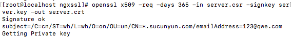

[TOC]

#准备工作

1. 安装nginx

2. 生成https证书

#安装nginx

安装步骤略

nginx -V

需要保证nginx有http_ssl_module模块

#生成https证书

测试环境使用自签名证书测试

##安装依赖库

yum -y install gcc gcc-c++ autoconf

yum -y install openssl openssl-devel

##创建服务密钥和证书

1. 切换到root目录（需要使用root权限，其他用户也可以）

2. 创建密钥存放目录mkdir -p /root/ngxssl

3. 创建服务器私有密钥，将会要求输入密码，注意保证记住密码

openssl genrsa -des3 -out server.key 1024


4. 创建证书签名

openssl req -new -key server.key -out server.csr

需要注意的是大部分信息可以随意填写，但是Common Name一行需要填写证书绑定的域名，注意可以绑定域名为单个域名或者绑定多个域名，例如：pan.cloudhua.com或者*.cloudhua.com。


5. 删除密码

密码会导致很多麻烦的事情，每次nginx重启或者web 服务器重启都需要输入密码，测试环境先删除掉密码，如果不需要删除密码可以跳过此步骤。操作中会要求输入创建密钥时候输入的密码。


6. 签署ssl证书

上述操作证书已经生成完成，最后一步需要签名证书，可以指定签名过期时间，命令中365位置就是过期时间。

openssl x509 -req -days 365 -in server.csr -signkey server.key -out server.crt



#配置nginx https

创建https配置文件，这里建议将https配置单独出来，然后在nginx.conf文件中include进去即可。

1. 创建https.conf文件配置https相关信息

```

listen 443 ssl;  #监听端口
ssl_certificate /opt/https/cloudhua.com.crt; #密钥传给客户端使用。
ssl_certificate_key /opt/https/cloudhua.com.key; #服务器密钥私钥。
ssl_protocols SSLv3 TLSv1; #使用SSL/TLS协议版本信息。
ssl_ciphers HIGH:!ADH:!EXPORT57:RC4+RSA:+MEDIUM; #使用的加密算法，选择加密套件，不同的浏览器所支持的套件（和顺序）可能会不同。这里指定的是OpenSSL库能够识别的写法，你可以通过 openssl -v cipher 'RC4:HIGH:!aNULL:!MD5'（后面是你所指定的套件加密算法） 来看所支持算法。

ssl_prefer_server_ciphers on; #设置协商加密算法时，优先使用我们服务端的加密套件，而不是客户端浏览器的加密套件。

ssl_session_cache shared:SSL:2m; #设置ssl/tls会话缓存的类型和大小。如果设置了这个参数一般是shared，buildin可能会参数内存碎片，默认是none，和off差不多，停用缓存。如shared:SSL:10m表示我所有的nginx工作进程共享ssl会话缓存，官网介绍说1M可以存放约4000个sessions。 详细参考serverfault上的问答ssl_session_cache。

ssl_session_timeout 5m; #客户端可以重用会话缓存中ssl参数的过期时间，内网系统默认5分钟太短了，可以设成30m即30分钟甚至4h。

```

nginx ssl参数设置可以参考这篇博客[https://segmentfault.com/a/1190000002866627](https://segmentfault.com/a/1190000002866627)

2. 将https.conf添加到nginx.conf文件

```

server {

    listen 80;

    server_name example.com;

    include https.conf;

    ...

}

```