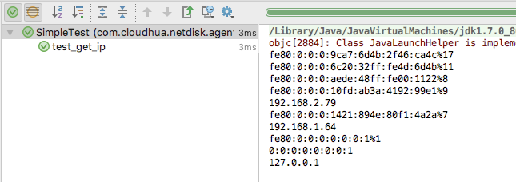
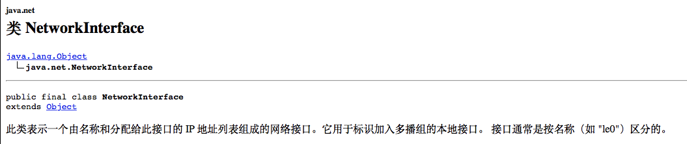
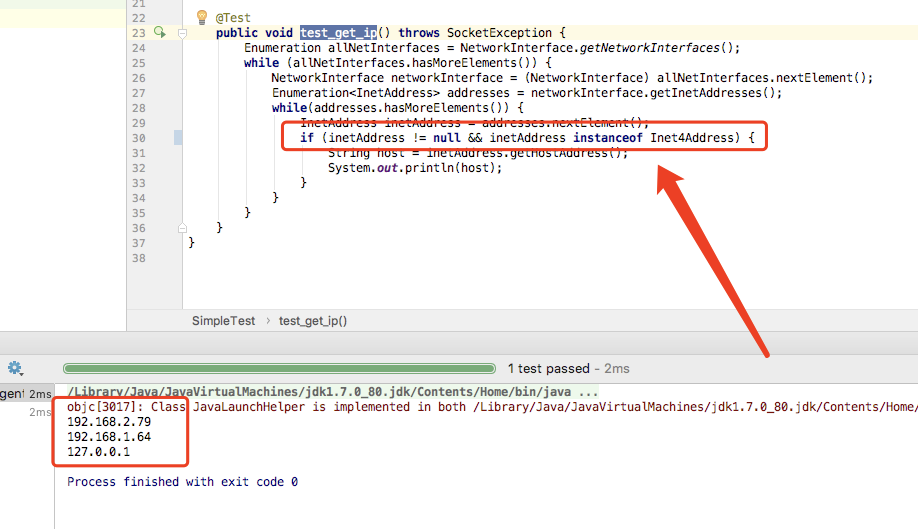

#如何获取本机IP？

直接上代码：

```

    @Test
    public void test_get_ip() throws SocketException {
        Enumeration allNetInterfaces = NetworkInterface.getNetworkInterfaces();
    while (allNetInterfaces.hasMoreElements()) {
            NetworkInterface networkInterface = (NetworkInterface) allNetInterfaces.nextElement();
            Enumeration<InetAddress> addresses = networkInterface.getInetAddresses();
    while(addresses.hasMoreElements()) {
                InetAddress inetAddress = addresses.nextElement();
    if (inetAddress != null) {
                    String host = inetAddress.getHostAddress();
                    System.out.println(host);
                }
            }
        }
    }

```

运行该test执行结果有：



#代码解析

- 首先通过NetworkInterface静态方法获取本机上所有网卡信息，我本机上的网卡信息有：


查询NetworkInterface类文档如下描述：



- while循环获取每个网卡信息，包括虚拟网卡等

- 获取每个网卡信息对应的InetAddress对象，通过InetAddress对象获取网卡的ipv4地址或者ipv6地址

- 如果想仅获取ipv4地址可以做如下处理，添加是否是Inet4Address判断，获取ipv6一样操作：

