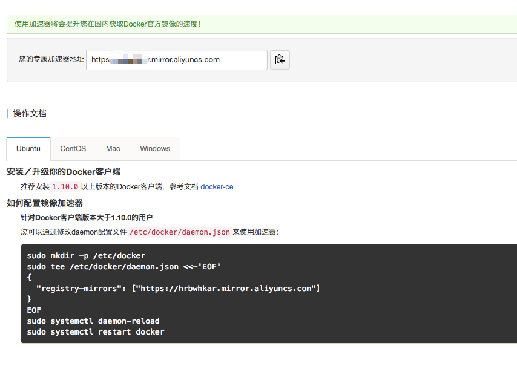
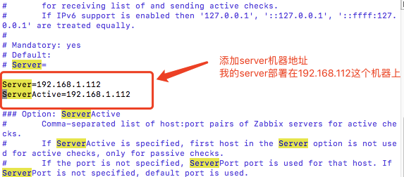
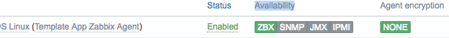

centos6安装使用在线安装脚本，centos7环境下使用docker安装

#有网状态下

##centos6

下载安装脚本：[https://github.com/BillWang139967/zabbix_install.git](https://github.com/BillWang139967/zabbix_install.git)执行脚本安装。

安装的服务有：

zabbix-server

zabbix-agent  运行端口是10050

zabbix mysql服务  运行端口3306

zabbix web服务  端口9000

nginx服务 端口80

监控运行状态服务monit 端口2812

登录到zabbix界面，http://host/zabbix即可进入到zabbix控制台界面，默认账号密码Admin密码zabbix，http://host:2812可以进入到监控服务界面，默认账号myuser密码mypassword

##centos7

使用docker安装

###安装docker

参照的官网安装步骤

[https://docs.docker.com/engine/installation/linux/docker-ce/centos/#install-using-the-repository](https://docs.docker.com/engine/installation/linux/docker-ce/centos/#install-using-the-repository)

 - 移除老版本的docker程序

```

yum remove docker \

                  docker-common \

                  docker-selinux \

                  docker-engine

```

- 安装依赖库

```

yum install -y yum-utils \

  device-mapper-persistent-data \

  lvm2

```

- 添加docker镜像源地址

```

yum-config-manager \

    --add-repo \

    https://download.docker.com/linux/centos/docker-ce.repo

```

- 开启edge，test，如果关闭请使用disable参数关闭

```

yum-config-manager --enable docker-ce-edge

yum-config-manager --enable docker-ce-test

yum-config-manager --disable docker-ce-edge

```

- 安装docker-ce

```

yum install docker-ce

```

- 检测安装结果，查看可用版本

```

yum list docker-ce --showduplicates | sort -r

docker-ce.x86_64            17.09.ce-1.el7.centos             docker-ce-stable

```

- 启动docker，添加到开机自启动

```

systemctl start docker

chkconfig docker on

```

- 运行helloworld，执行后会打印出来成功运行信息

```

docker run hello-world

```

###使用docker阿里镜像加速

进入阿里云服务https://dev.aliyun.com/，注册登陆后访问镜像服务地址https://cr.console.aliyun.com/#/accelerator

按照下面说明的配置方法添加加速地址。（ubuntu和centos配置相同的）配置文件daemon.json没有手动创建。



###安装zabbix

安装文档参照

[https://github.com/BillWang139967/zabbix_install/wiki/server_docker](https://github.com/BillWang139967/zabbix_install/wiki/server_docker)  有线环境

[https://github.com/BillWang139967/zabbix_install/wiki/server_offline_docker](https://github.com/BillWang139967/zabbix_install/wiki/server_offline_docker) 离线环境

 #遇到的问题

##问题一

安装完成后在监控机器上安装agent，server上无法获取监控机器信息，建立Host，Configuration--Hosts页面新建立的Host   Availability下ZBX为红色，无法获取agent信息。

修复方法，登录agent安装机器，修改agent配置文件（我的机器上是/etc/zabbix/zabbix_agentd.conf)，添加一下图片中两个配置项：



添加完成后重启agent，查看server状态变成绿色正常显示agent机器信息：



##问题二

尝试在centos6上使用docker安装，运行容器的时候报错无法运行，zabbix无法起动已经联系docker镜像作者（王斌）询问问题所在，还没有回复。