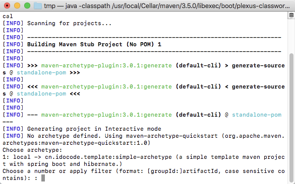
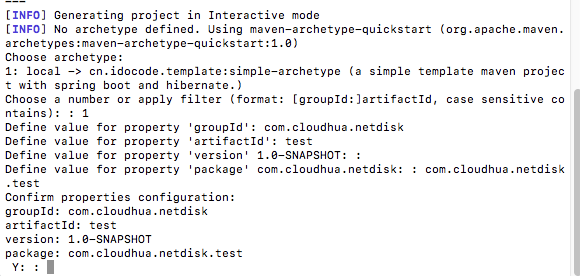
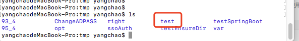
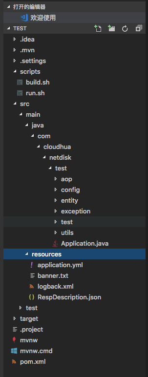

- 创建好模板工程示例

- 模板工程示例根目录下使用 mvn archetype:create-from-project 创建模板

- 构建完成后进入到target->generated-sources->archetype目录下执行mvn install安装到本地库中

- 使用新的模板创建工程mvn archetype:generate -DarchetypeCatalog=local

本地有个1 cn.idocode.template的模板

选择1，输入必要参数，完成设置即可

目录下生成工程项目

项目工程结构与模板一致

#相关脚本

installMaven.sh

linux环境下联网安装maven，版本apache-maven-3.5.2-bin.tar.gz

exportLocalArchetype.sh 根据archetype-catalog.xml导出本地archttype模板

importLocalArchetype.sh 将导出的archetype_local目录导入到本地maven环境中