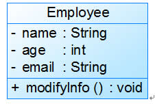
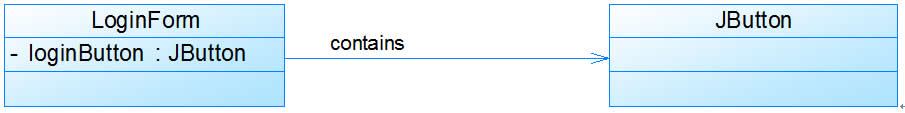

整理自刘伟老师的博客深入浅出UML类图

地址: [http://blog.csdn.net/LoveLion/article/category/738449](http://blog.csdn.net/LoveLion/article/category/738449)

#类

- 实体类 数据库实体关系对象

- 控制类 业务逻辑传递对象

- 边界类 程序系统和用户之间交互对象，如菜单窗口对话框等等

注释：在web应用开发过程中控制类和边界类类似，在我开发的web应用中，前后端分离一般是将业务控制类

uml类图一般包含三个部分

- 类名 格式：可见性 属性名 属性类型 [=默认值]

- 属性 格式：可见性 方法名(参数列表) 返回值类型

- 方法

还有可能包含内部类

示例：

#类之间关系

##关联关系

LoginFrorm包含JButton类

关联关系还可细分为几种

###双向关联关心

###单向关联关系

###自关联

注释： 如常用的单例模式使用自关联

###多重关联性

多重性关联关系又称为重数性(Multiplicity)关联关系，表示两个关联对象在数量上的对应关系。在UML中，对象之间的多重性可以直接在关联直线上用一个数字或一个数字范围表示。
对象之间可以存在多种多重性关联关系，常见的多重性表示方式如下所示：

表1  多重性表示方式列表

表示方式

多重性说明：
- 1..1

表示另一个类的一个对象只与该类的一个对象有关系
- 0..*

表示另一个类的一个对象与该类的零个或多个对象有关系
- 1..*

表示另一个类的一个对象与该类的一个或多个对象有关系
- 0..1

表示另一个类的一个对象没有或只与该类的一个对象有关系
- m..n

表示另一个类的一个对象与该类最少m，最多n个对象有关系 (m≤n)

      例如：一个界面(Form)可以拥有零个或多个按钮(Button)，但是一个按钮只能属于一个界面，因此，一个Form类的对象可以与零个或多个Button类的对象相关联，但一个Button类的对象只能与一个Form类的对象关联，如图5所示：

###聚合关系

聚合(Aggregation)关系表示整体与部分的关系。在聚合关系中，成员对象是整体对象的一部分，但是成员对象可以脱离整体对象独立存在。在UML中，聚合关系用带空心菱形的直线表示。例如：汽车发动机(Engine)是汽车(Car)的组成部分，但是汽车发动机可以独立存在，因此，汽车和发动机是聚合关系，如图所示：

在代码实现聚合关系时，成员对象通常作为构造方法、Setter方法或业务方法的参数注入到整体对象中。

###组合关系

组合(Composition)关系也表示类之间整体和部分的关系，但是在组合关系中整体对象可以控制成员对象的生命周期，一旦整体对象不存在，成员对象也将不存在，成员对象与整体对象之间具有同生共死的关系。在UML中，组合关系用带实心菱形的直线表示。例如：人的头(Head)与嘴巴(Mouth)，嘴巴是头的组成部分之一，而且如果头没了，嘴巴也就没了，因此头和嘴巴是组合关系，如图所示：

在代码实现组合关系时，通常在整体类的构造方法中直接实例化成员类，组合菱形框实心

注释： 理解聚合关系和组合关系需要理解的是，成员变量和类的关系和使用方法

构造方法或set方法传入，聚合关系（变量可以单独存在）

构造方法直接new或者成员变量直接new，组合关系（无法缺少的变量）

###依赖关系

依赖(Dependency)关系是一种使用关系，特定事物的改变有可能会影响到使用该事物的其他事物，在需要表示一个事物使用另一个事物时使用依赖关系。大多数情况下，依赖关系体现在某个类的方法使用另一个类的对象作为参数。在UML中，依赖关系用带箭头的虚线表示，由依赖的一方指向被依赖的一方。例如：驾驶员开车，在Driver类的drive()方法中将Car类型的对象car作为一个参数传递，以便在drive()方法中能够调用car的move()方法，且驾驶员的drive()方法依赖车的move()方法，因此类Driver依赖类Car，如图所示

在系统实施阶段，依赖关系通常通过三种方式来实现，第一种也是最常用的一种方式是如图所示的将一个类的对象作为另一个类中方法的参数（参数），第二种方式是在一个类的方法中将另一个类的对象作为其局部变量（直接new或者工厂方法获取），第三种方式是在一个类的方法中调用另一个类的静态方法（static）。

###泛化关系（继承）

在UML中，泛化关系用带空心三角形的直线来表示。

###接口与实现关系

面向接口编程，在UML中，类与接口之间的实现关系用带空心三角形的虚线来表示。接口定义，属性方法都是public static。

