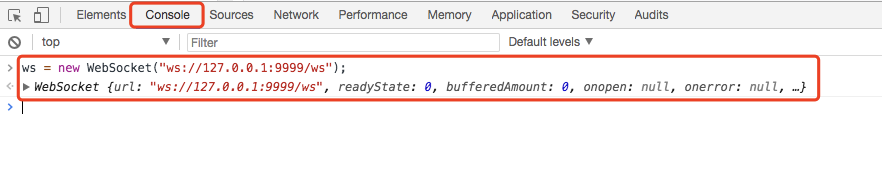
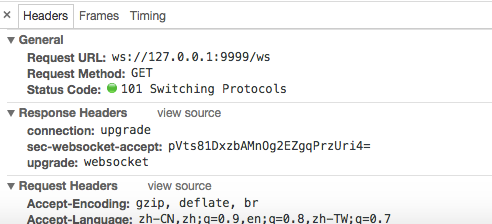
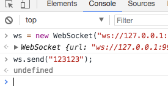
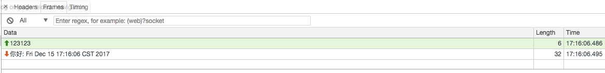

#介绍

使用netty开发websocket服务器demo。

#项目准备

环境：java开发环境、maven项目管理工具、idea开发工具、chrome浏览器

#编写代码

##编写服务端

NettyServer

```

    import io.netty.bootstrap.ServerBootstrap;
    import io.netty.channel.ChannelFuture;
    import io.netty.channel.ChannelOption;
    import io.netty.channel.EventLoopGroup;
    import io.netty.channel.nio.NioEventLoopGroup;
    import io.netty.channel.socket.nio.NioServerSocketChannel;
    
    public class NettyServer extends Thread {
    private int port;
    
    public NettyServer(int port) {
    this.port = port;
        }
    
    public void run() {
            EventLoopGroup bossGroup = new NioEventLoopGroup();
            EventLoopGroup workGroup = new NioEventLoopGroup();
    
    try {
                ServerBootstrap serverBootstrap = new ServerBootstrap();    // server netty启动类
    serverBootstrap.group(bossGroup, workGroup)                 // 设置处理线程工作线程
    .channel(NioServerSocketChannel.class)              // 设置channel实例类型
    .childHandler(new WebSocketChannelInitializer())    // 设置handler
    .option(ChannelOption.SO_BACKLOG, 128)        // 设置channel参数
    .childOption(ChannelOption.SO_KEEPALIVE, true);  // 设置工作线程配置
    
    ChannelFuture channelFuture = serverBootstrap.bind(port).sync();
                channelFuture.channel().closeFuture().sync();
            } catch (InterruptedException e) {
                e.printStackTrace();
            } finally {
                bossGroup.shutdownGracefully();
                workGroup.shutdownGracefully();
            }
        }
    
    public static void main(String[] args) throws InterruptedException {
    new NettyServer(9999).start();
            System.out.println("start ok.");
        }
    }

```

处理类handler

```

    import io.netty.channel.Channel;
    import io.netty.channel.ChannelHandlerContext;
    import io.netty.channel.SimpleChannelInboundHandler;
    import io.netty.handler.codec.http.websocketx.TextWebSocketFrame;
    
    import java.util.Date;
    
    public class DiscardServerHandler extends SimpleChannelInboundHandler<TextWebSocketFrame> {
    @Override
    protected void channelRead0(ChannelHandlerContext ctx, TextWebSocketFrame msg) throws Exception {
            Channel channel = ctx.channel();
            System.out.println(channel.remoteAddress() + ": " + msg.text());
            ctx.channel().writeAndFlush(new TextWebSocketFrame("你好: " + new Date()));
        }
    
    @Override
    public void handlerAdded(ChannelHandlerContext ctx) throws Exception {
            System.out.println("ChannelId" + ctx.channel().id().asLongText());
        }
    
    @Override
    public void handlerRemoved(ChannelHandlerContext ctx) throws Exception {
            System.out.println("拜拜: " + ctx.channel().id().asLongText());
        }
    
    @Override
    public void exceptionCaught(ChannelHandlerContext ctx, Throwable cause) throws Exception {
            ctx.channel().close();
        }
    }

```

websocket初始化channel设置

以下代码摘自博客

```

    import io.netty.channel.ChannelInitializer;
    import io.netty.channel.ChannelPipeline;
    import io.netty.channel.socket.SocketChannel;
    import io.netty.handler.codec.http.HttpObjectAggregator;
    import io.netty.handler.codec.http.HttpServerCodec;
    import io.netty.handler.codec.http.websocketx.WebSocketServerProtocolHandler;
    import io.netty.handler.stream.ChunkedWriteHandler;
    
    public class WebSocketChannelInitializer extends ChannelInitializer<SocketChannel> {
    @Override
    protected void initChannel(SocketChannel ch) throws Exception {
            ChannelPipeline pipeline = ch.pipeline();
    //HttpServerCodec: 针对http协议进行编解码
    pipeline.addLast("httpServerCodec", new HttpServerCodec());
    //ChunkedWriteHandler分块写处理，文件过大会将内存撑爆
    pipeline.addLast("chunkedWriteHandler", new ChunkedWriteHandler());
    /**
             * 作用是将一个Http的消息组装成一个完成的HttpRequest或者HttpResponse，那么具体的是什么
             * 取决于是请求还是响应, 该Handler必须放在HttpServerCodec后的后面
             */
    pipeline.addLast("httpObjectAggregator", new HttpObjectAggregator(8192));
    
    //用于处理websocket, /ws为访问websocket时的uri
    pipeline.addLast("webSocketServerProtocolHandler", new WebSocketServerProtocolHandler("/ws"));
    
            pipeline.addLast("myWebSocketHandler", new DiscardServerHandler());   // 自己的websocket处理类
        }
    }

```

#测试

运行程序，使用chrome连接

- 打开chrome，f12打开开发者模式（mac下ctrl+alt+i）

- 打开控制台console标签输入连接websocket 

ws = new WebSocket("ws://127.0.0.1:9999/ws");

- 进入到network标签可以看到连接服务端信息



- 客户端给服务单发信息



查看帧信息



看到浏览器发送“123123”信息

服务端返回信息到达时间

##注意

这里是测试使用chrome调试的时候注意不要再https连接页面下打开开发者控制台，会无法连接。

#nginx转发websocket

线上项目相对复杂可能会出现仅开放一个端口的情况，websocket服务这里不能与http服务使用相同端口，故使用nginx在服务端前做反向代理，提高性能也能满足共用一个端口暴露服务。

##注意事项

- nginx需要使用1.3以上版本才支持websocket设置

- 配置示例参照官网，详细信息和参数可参照官方网站：[http://nginx.org/en/docs/http/websocket.html](http://nginx.org/en/docs/http/websocket.html)

##配置方法

```

# 在http下配置

    map $http_upgrade $connection_upgrade {

        default upgrade;

        ''      close;

    }

# 在localtion下配置

location /ws {

    proxy_pass [http://ip:port;](http://ip:port;)   # websocket服务处理地址 

    proxy_http_version 1.1;  # 升级http服务

    proxy_set_header Upgrade $http_upgrade; # 升级http服务

    proxy_set_header Connection "upgrade"; # 升级http服务

}

```

其他需求按照要求添加nginx配置即可