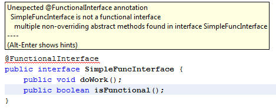
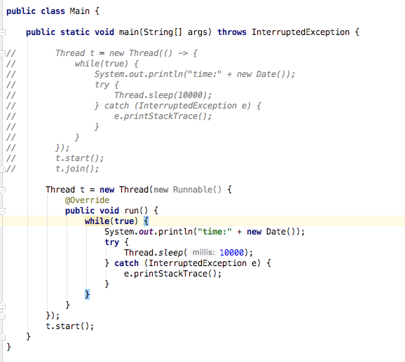
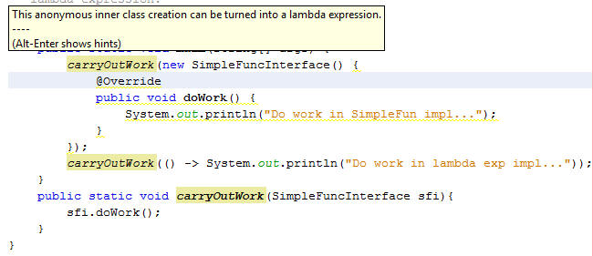

[TOC]

摘自官方文档：[http://www.oracle.com/webfolder/technetwork/tutorials/obe/java/Lambda-QuickStart/index.html](http://www.oracle.com/webfolder/technetwork/tutorials/obe/java/Lambda-QuickStart/index.html)

参考文档：

- [https://sanaulla.info/2013/03/21/introduction-to-functional-interfaces-a-concept-recreated-in-java-8/](https://sanaulla.info/2013/03/21/introduction-to-functional-interfaces-a-concept-recreated-in-java-8/)

- http://ifeve.com/jjava-util-function-java8/

以简短方式介绍java8中加入支持lambda特性，不按照原文文档翻译。

#前言

##目标

该教程主要介绍，java8中对lambda的支持，学习时间预计一小时。

##介绍

lambda表达式支持是java8中添加的重要的新特性，提供了一种简洁的方式表示一个方法，使用lambda表达式以一种更简洁的方式遍历、过滤、取出数据操作Collection集合。总的来讲，新的特性提高了复杂环境下的开发效率。

该教程示例描述了lambda的使用示例，以及新增java.util.function包内Predicate and Function类使用示例。

##环境要求

- jdk8

- 一种开发工具（idea，eclipse或者其他）

- jdk8 api文档

#背景

##匿名内部类

一般情况下匿名内部类在某些业务逻辑调用一次的位置，例如java swing组件中按钮类响应或者键盘事件响应等等。

官方文档示例：

```

JButton testButton = new JButton("Test Button");
testButton.addActionListener(new ActionListener(){

> @Override public void actionPerformed(ActionEvent ae){
> 
>     System.out.println("Click Detected by Anon Class");
> 
> }

});

```

常用情况就是在启动一个线程时候直接使用内部匿名类启动。当然下面的示例中完全可以使用创建一个Thread的子类或者其他方式实现，这里仅表示一下内部匿名类的使用

```

    public class Main {
    
    public static void main(String[] args) {
    
    new Thread(new Runnable() {
    @Override
    public void run() {

                    while (true) {
                        System.out.println("time:" + new Date());
    

>     try {
> 
> 
>                         Thread.sleep(10000);
> 
> 
>                     } catch (InterruptedException e) {
> 
> 
>                         e.printStackTrace();
> 
> 
>                     }

                    }
                }
            }).start();
        }
    }

```

使用内部匿名类的方式代码上并不简洁优雅，很多代码被定义到一处，冗余很多。

##Functional Interfaces

功能性接口

上面例子中开启线程使用内部匿名类的方式开启功能，我们可以定义接口Runnable接口实现上述功能，runnable的官方类如下：

```

    public
    interface Runnable {
    /**
         * When an object implementing interface <code>Runnable</code> is used
         * to create a thread, starting the thread causes the object's
         * <code>run</code> method to be called in that separately executing
         * thread.
         * <p>
         * The general contract of the method <code>run</code> is that it may
         * take any action whatsoever.
         *
         * @see     java.lang.Thread#run()
         */
    public abstract void run();
    }

```

想这些仅有一个方法的接口，在java8中我们叫做“functional interface”。

这种仅包含一个方法的functional interface用作内部匿名类是一种常见的方式，这些functional interface很适合使用lambda表达式。

##lambda表达式语法

lambda表达式省去了内部匿名类繁重的代码，仅用一行语句完成逻辑代码。

一个lambda表达式包含三个部分：

Argument ListArrow TokenBody`(int x, int y)``->``x + y`

表达式中body区域可以是一句简单的表达计算式或者是一个代码块，在表达式中简单计算并且返回，如果body是个代码块使用return标识返回结果。在代码块中顶层逻辑禁止使用break和continue关键字，循环中可以使用。
简单示例：

```

(int x, inty) -> x + y

() -> 42

(String s) -> { System.out.println(s); }

```

示例中第一行表达式接受两个参数int型的x和y返回两者相加的和，也可以使用代码计算结果后使用return返回结果（但是这种方式又多了几行代码，引入lambda表达式就是为了减少代码，更简洁优雅的写代码），第二个示例没有任何参数直接返回42结果，第三个示例接受string类型参数s，打印到控制台上。

上面说明了一些lambda的简单实用，接下结束一些更深入的示例。

#lambda示例

##Runnable使用lambda示例

将第一个匿名内部类启动线程的示例修改成使用啦，labda示例

```

    
        public class Main {
        
        public static void main(String[] args) throws InterruptedException {
        
                Thread t = new Thread(() -> {
        while(true) {
                        System.out.println("time:" + new Date());
        try {
                            Thread.sleep(10000);
                        } catch (InterruptedException e) {
                            e.printStackTrace();
                        }
                    }
                });
                t.start();
                t.join();
            }
        }
    
    
    

```

经过修改之后没有任何参数传入和返回，在内部打印出当前时间并停止十秒后执行下一次。

##Comparator Lambda

Comparator比较器可以用来排序集合中元素顺序、可以比较同一种类型两个实例等等。

实例：

```

    public class Person {
    private String givenName;
    private String surName;
    private int age;
    private Gender gender;
    private String eMail;
    private String phone;
    private String
    address;
    }

```

```

    public class ComparatorTest {
    public static void main(String[] args) {
    
            List<Person> personList = Person.createShortList();
    // Sort with Inner Class
    Collections.sort(personList, new Comparator<Person>(){
    public int compare(Person p1, Person p2){
    return p1.getSurName().compareTo(p2.getSurName());
                 }
             });
            System.out.println("=== Sorted Asc SurName ===");
    for(Person p:personList){
                p.printName();
            }
    // Use Lambda instead
            // Print Asc
    System.out.println("=== Sorted Asc SurName ===");
            Collections.sort(personList, (Person p1, Person p2) -> p1.getSurName().compareTo(p2.getSurName()));
    for(Person p:personList){
                p.printName();
            }
    // Print Desc
    System.out.println("=== Sorted Desc SurName ===");
            Collections.sort(personList, (p1,  p2) -> p2.getSurName().compareTo(p1.getSurName()));
    for(Person p:personList){
                p.printName();
            }
        }
    }

```

第一个排序实例中使用内部匿名类方式，二、三示例使用lambada方式，注意的是第二个示例入参标注参数类型，第三个没有，lambda可可以按照参数顺序来推断参数的类型。

##Listener Lambda

监听器在写业务逻辑中经常使用。

```

    public class ListenerTest {
    public static void main(String[] args) {
            JButton testButton = new JButton("Test Button");
            testButton.addActionListener(new ActionListener(){
    @Override 
    public void actionPerformed(ActionEvent ae){
                    System.out.println("Click Detected by Anon Class");
                }
            });
            testButton.addActionListener(e -> System.out.println("Click Detected by Lambda Listner"));
    
    // Swing stuff
    JFrame frame = new JFrame("Listener Test");
            frame.setDefaultCloseOperation(JFrame.EXIT_ON_CLOSE);
            frame.add(testButton, BorderLayout.CENTER);
            frame.pack();
            frame.setVisible(true);
        }
    }

```

上述示例中lambda表达式被当做一个参数传入。

Target typing is used in a number of contexts including the following:

- Variable declarations
- Assignments
- Return statements
- Array initializers
- Method or constructor arguments
- Lambda expression bodies
- Conditional expressions ?:
- Cast expressions

##本章代码示例

摘自官网示例资源文件

[](wiz://open_attachment?guid=fe73f7ce-9a8a-4724-afdd-576d69b3c947)

#使用lambda表达式improve your code

这个章节通过分析讲解之前的示例代码来说明lambda如何提升你的代码质量，使用lambda的时候应该心中默念“不要出现重复代码”，其本意就是你写这一条lambda表达式不要再其他地方出现，如果重复出现了则说明这里可以提出来写方法或者类来复用lambda表达式。使用lambda表达式使代码更简洁明了可读性更好。

该章主要通过示例代码讲解lambda使用，详情参见：[http://www.oracle.com/webfolder/technetwork/tutorials/obe/java/Lambda-QuickStart/index.html](http://www.oracle.com/webfolder/technetwork/tutorials/obe/java/Lambda-QuickStart/index.html)

Imporving Code With Lambda Expressions

这里找到几篇博客讲解DRY（Don't repeat yourself）思想

中文博客：[http://blog.csdn.net/tyc8996/article/details/6519472](http://blog.csdn.net/tyc8996/article/details/6519472)

维基百科：https://en.wikipedia.org/wiki/Don%27t_repeat_yourself

#java.util.function包

这个包是java8正式添加的工具包，其中包含丰富的functional interface，标准的functional interface类有：

- Predicate: A property of the object passed as argument
- Consumer: An action to be performed with the object passed as argument
- Function: Transform a T to a U
- Supplier: Provide an instance of a T (such as a factory)
- UnaryOperator: A unary operator from T -> T
- BinaryOperator: A binary operator from (T, T) -> T

##Function Interface

Function Interface该接口存在一个apply()方法

```

public R apply(T t){ }

```

接受class参数t返回普通类R，例如参数是Person类返回String，返回的String用来打印Person信息。

```

public String printCustom(Function <Person, String> f){
    return f.apply(this);
}

```

在java8中新增@FunctionalInterface注解标示接口是一个Functional Interface，示例：

来看一个仅有一个抽象方法的接口：

```

@FunctionalInterface

public interface SimpleFuncInterface {

  public void doWork();

}

```

当我们在functional接口中添加 java.lang.Object类方法时不会抛出异常信息：

```

@FunctionalInterface

public interface SimpleFuncInterface {

  public void doWork();

  public String toString();

  public boolean equals(Object o);

}

```

当增加另外一个抽象方法(非Object的)时候编译器会帮助我们识别该注解，并提示错误：



一个子interface可以继承其他Functional的interface，子interface没有增加任何抽象方法但是他仍是functional，Functional的接口可以包含一个抽象方法和其他一组default方法。（什么是接口的default方法，请查询其他资料）

示例：

```

@FunctionalInterface

public interface ComplexFunctionalInterface extends SimpleFuncInterface {

  default public void doSomeWork(){

    System.out.println("Doing some work in interface impl...");

  }

  default public void doSomeOtherWork(){

    System.out.println("Doing some other work in interface impl...");

  }

}

```

在我们的ide开发工具中如果支持lambda语法，当我们使用内部匿名类的时候会做出提示告诉我们这里可以修改成lambda表达式，当然这个功能不是每个ide都会有的。我的idea里面没有提示如下：



在原文作者博客中使用([Netbeans 8 Nightly builds](http://bertram2.netbeans.org:8080/job/jdk8lambda/lastSuccessfulBuild/artifact/nbbuild/))：



##fucntion包使用示例

本章给出function包内两个接口Function和Predicate使用示例，包内其他api详情请参照官方文档：https://docs.oracle.com/javase/8/docs/api/

###Function接口

@FunctionalInterface

public interface Function<T,R>

Represents a function that accepts one argument and produces a result.

该Function接口代表函数接受一个参数返回一个结果

该接口提供一个抽象方法：

R apply(T)

T - the type of the input to the function

R - the type of the result of the function

Function接口中除了apply()之外全部接口如下

default <V> Function<T,V> andThen(Function<? super R,? extends V> after) 返回一个先执行当前函数对象apply方法再执行after函数对象apply方法的函数对象。

default <V> Function<T,V> compose(Function<? super V,? extends T> before)返回一个先执行before函数对象apply方法再执行当前函数对象apply方法的函数对象。

static <T> Function<T, T> identity() 返回一个执行了apply()方法之后只会返回输入参数的函数对象。

代码示例

```

    import java.util.function.Function;
    
    public class TestFunction {
    public static void main(String[] args) {
    int incr = 20;
    int n = 10;
            FuncotionDemo.modifyTheValue(n, val -> val + incr);
            n = 15;
            FuncotionDemo.modifyTheValue(n, val -> val * 10);
            FuncotionDemo.modifyTheValue(n, val -> val - 100);
            FuncotionDemo.modifyTheValue(n, val -> "test".length() + val - 100);
        }
    }
    
    class FuncotionDemo {
    static void modifyTheValue (int value, Function<Integer, Integer> fucntion) {
    int newValue = fucntion.apply(value);
            System.out.println(newValue);
        }
    }

    
    

    // 执行结果

    30
    
    150
    
    -85
    
    -81

    ```
    

###Predicate接口

@FunctionalInterface

public interface Predicate<T>

Represents a predicate (boolean-valued function) of one argument.

该接口判断一个对象是否符合条件结果返回true或者false

提供抽象接口：

boolean test(T t)

T - the type of the input to the predicate 输入需要做判断的对象

除了test外还提供其他接口如下：

```

/**

     * Returns a composed predicate that represents a short-circuiting logical

     * AND of this predicate and another.  When evaluating the composed

     * predicate, if this predicate is {@code false}, then the {@code other}

     * predicate is not evaluated.

     *

     * <p>Any exceptions thrown during evaluation of either predicate are relayed

     * to the caller; if evaluation of this predicate throws an exception, the

     * {@code other} predicate will not be evaluated.

     *

     * @param other a predicate that will be logically-ANDed with this

     *              predicate

     * @return a composed predicate that represents the short-circuiting logical

     * AND of this predicate and the {@code other} predicate

     * @throws NullPointerException if other is null

     */

    default Predicate<T> and(Predicate<? super T> other) {

        Objects.requireNonNull(other);

        return (t) -> test(t) && other.test(t);

    }

    /**

     * Returns a predicate that represents the logical negation of this

     * predicate.

     *

     * @return a predicate that represents the logical negation of this

     * predicate

     */

    default Predicate<T> negate() {

        return (t) -> !test(t);

    }

    /**

     * Returns a composed predicate that represents a short-circuiting logical

     * OR of this predicate and another.  When evaluating the composed

     * predicate, if this predicate is {@code true}, then the {@code other}

     * predicate is not evaluated.

     *

     * <p>Any exceptions thrown during evaluation of either predicate are relayed

     * to the caller; if evaluation of this predicate throws an exception, the

     * {@code other} predicate will not be evaluated.

     *

     * @param other a predicate that will be logically-ORed with this

     *              predicate

     * @return a composed predicate that represents the short-circuiting logical

     * OR of this predicate and the {@code other} predicate

     * @throws NullPointerException if other is null

     */

    default Predicate<T> or(Predicate<? super T> other) {

        Objects.requireNonNull(other);

        return (t) -> test(t) || other.test(t);

    }

    /**

     * Returns a predicate that tests if two arguments are equal according

     * to {@link Objects#equals(Object, Object)}.

     *

     * @param <T> the type of arguments to the predicate

     * @param targetRef the object reference with which to compare for equality,

     *               which may be {@code null}

     * @return a predicate that tests if two arguments are equal according

     * to {@link Objects#equals(Object, Object)}

     */

    static <T> Predicate<T> isEqual(Object targetRef) {

        return (null == targetRef)

                ? Objects::isNull

                : object -> targetRef.equals(object);

    }

```

从官方注释可以看出这些方法提供的是与或非等操作。

示例：

```

    import java.util.function.Predicate;
    
    public class TestPredicate {
    public static void main(String[] args) {
            Predicate<Object> testString = param -> param instanceof String;
    boolean result = testString.test(1);
            System.out.println("1:" + result);
            result = testString.test("nihao");
            System.out.println("2:" + result);
        }
    }

    
    

    // 执行结果

    1:false
    
    2:true

    ```
    

其他接口使用详情参数官方api文档。