[TOC]

# 检查是否安装samba

rpm -qa | grep samba

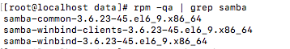

# 安装

yum install -y samba samba-client samba-common

# 检查安装是否完成

smbd --version

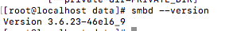

# 设置开机自启
chkconfig smb on

chkconfig nmb on

# 关闭SELinux安全设置

## 永久关闭

 - 编辑/etc/selinux/config，图中SELINUX设置成disable，重启后生效

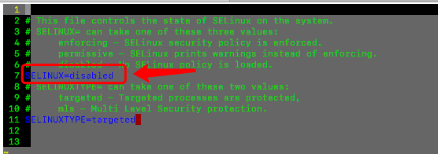

## 临时关闭

 - 命令行输入setenforce 0 表示设置selinux为permissive模式

# 设置防火墙

测试情况下可以直接关闭防火墙，service iptables stop

正式环境下修改iptables的规则设置

sudo iptables -I INPUT 4 -m state --state NEW -m udp -p udp --dport 137 -j ACCEPT

sudo iptables -I INPUT 5 -m state --state NEW -m udp -p udp --dport 138 -j ACCEPT

sudo iptables -I INPUT 6 -m state --state NEW -m tcp -p tcp --dport 139 -j ACCEPT

sudo service iptables save

# 设置smb配置文件

1. 进入目录/etc/samba./smb.conf

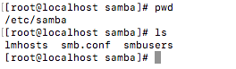

2. 备份smb.conf

cp smb.conf smb.conf.bk

3. 编辑smb.conf设置参数，配置文件中有详细的配置说明

================一下内容暂时保留=================

vim smb.conf

 - 设置GROUP名字和描述


 - 设置安全级别，默认设置即可，配置文件描述不见已修改share和server模式已经废弃

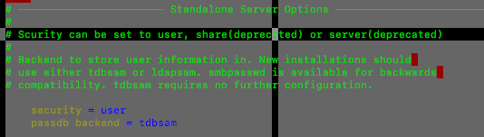

 - 在文件末尾添加分享设置


==================end===================

删除smb.conf文件内容

echo "" > smb.conf

添加一下内容

```

#======================= Global Settings =====================================

[global]

 workgroup = WORKGROUP   # 设置组名称

 security = share    设置为分享模式

 map to guest = bad user

#============================ Share Definitions ==============================

[MyShare]

 path = /data/sambatest    # 设置samba文件目录

 browsable =yes

 writable = yes    # 设置为读写状态，强制覆盖readonly

 guest ok = yes

 read only = no

```

# 重启samba服务并验证

service smb restart

service nmb restart

在windows服务器上输入samba服务器地址信息，服务器要求输入账号密码

我本地测试机器为192.168.1.187，在windows下打开资源管理器地址栏输入\\192.168.1.187进入

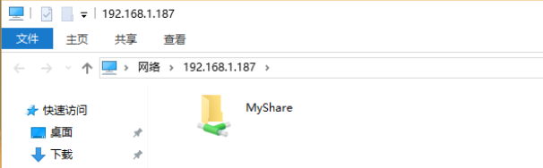

进入share目录的时候新建txt文件发现无法创建没权限

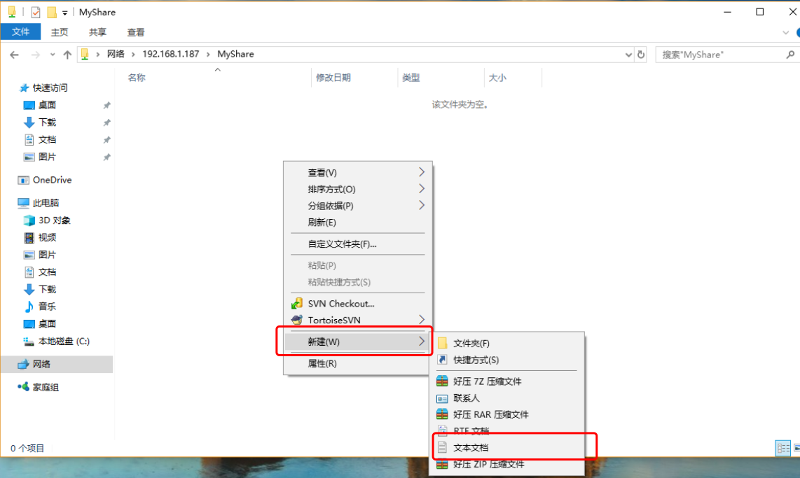

问题是我们centos服务器上目录权限不正确


设置为所有人可以访问

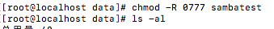

到window目录下创建文件，已经正常了

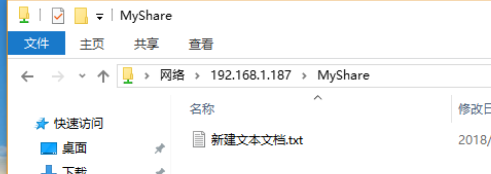

# 添加管理用户和组

## 添加一个group和用户

groupadd smbgrp

useradd sambauser
usermod -a -G smbgrp sambauser

## 设置samba用户的密码

smbpasswd -a sambauser

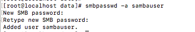

## 创建samba需要验证的目录

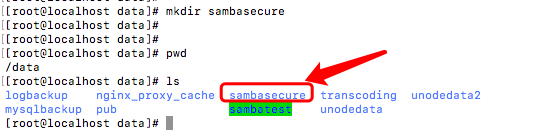

## 设置目录权限

chmod -R 0770 sambasecure
chown -R sambauser:smbgrp sambasecure
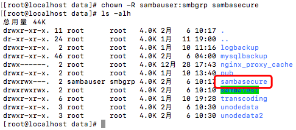

## 添加配置

编辑配置文件并添加以下内容

```

[Secure]

path = /data/sambasecure
valid users = @sambauser
guest ok = no
writable = yes
browsable = yes

```

重启服务器

## 验证

从windows服务器上查看已经出现Secure目录

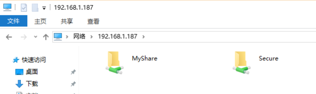

进入目录时需要使用账号密码验证

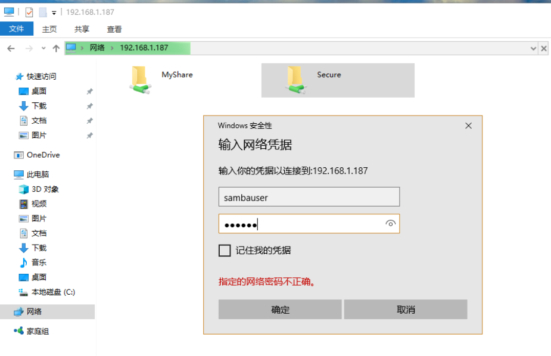

创建一个文件之后，在centos对应目录下查看

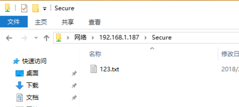

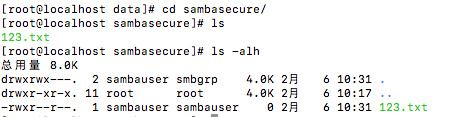

# 注意

 - 以上操作使用root，若使用普通用户请加上sudo

 - 原文中讲解详细看完本文之后可查看原文温习

# 参考链接

https://rbgeek.wordpress.com/2012/05/25/how-to-install-samba-server-on-centos-6/