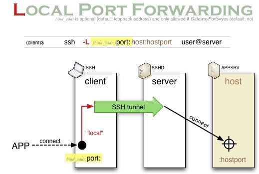
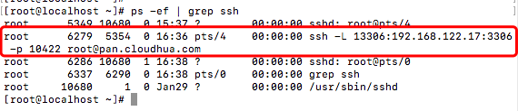
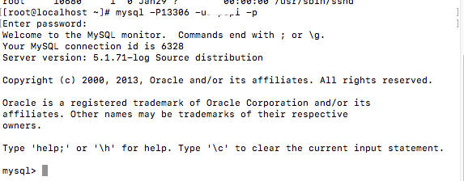
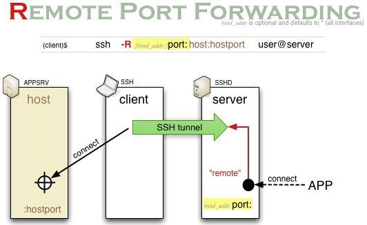
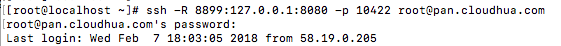
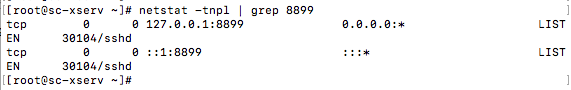
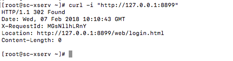
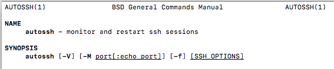

[TOC]

# 隧道简介

什么是ssh隧道？ssh隧道技术又称端口转发技术，是通过ssh加密连接传输网络数据的一种方式，他可以用来实现穿透nat防火墙远程访问局域网内服务器或者实现vpn。ssh隧道通过加密的ssh连接传输数据所以可以很好的保证传输数据的安全性。

# 本地端口转发（正向隧道）

## 介绍

本地端口转发将客户机的端口接收到的数据转发的跳转机上。ssh客户机配置一个端口接受连接，当连接建立的时候将数据通过ssh连接转发到ssh跳转机上，跳转机将数据转发到一个目标端口上，这个目标端口可以是跳转机本机端口也可以是其他服务器端口。

通常情况下本地端口转发用途有：

 - 通过跳转机转发session请求个文件传输

 - 外部网络通过隧道连接到局域网内部服务器

 - 跨网络（网段）连接文件服务器

该操作需要一台服务器作为跳转机，跳转机可以使标准的linux/unix服务器，通常跳转机需要加固增强安全性并且详细的记录连接信息等日志或者解析连接传输数据。

## 用法

本地端口转发使用到ssh -L参数：

ssh -L [bind_addr:]port:host:hostport

 - bind_addr 指定绑定的IP地址，默认情况会绑定在本地的回环地址（即127.0.0.1），如果空值或者为*会绑定本地所有的IP地址，如果希望绑定的端口仅供本机使用，可以指定为localhost。
 - port 指定本地绑定的端口
 - host 指定数据包转发目标地址的IP，如果目标主机和ssh server是同一台主机时该参数指定为localhost
 - host_port 指定数据包转发目标端口

ssh -L 80:192.168.1.110:80 root@www.jumpserver.com

上面的示例语句表示：使用通过www.jumpserver.com跳转机将本地80端口接收到的数据转发到192.168.1.110机器的80端口上。

## 示例

有三台示例服务器本地机器A（192.168.1.187），跳转机器B（pan.cloudhua.com），目标机器C（192.168.122.17）。

C上有一台mysql数据库服务仅允许内网服务器连接，现在想通过A服务器登录到C的mysql数据库上，使用ssh命令搭建隧道：

ssh -L 13306:192.168.122.17:3306 -p 10422 root@pan.cloudhua.com

输入密码之后成功登录B服务器：

在A服务器上可以看到已经搭建的隧道连接

在A服务器上指定端口登录mysql数据库：

A服务器已经可直接访问到C上的服务。

# 远端端口转发（反向代理）

## 介绍

远端端口转发将server服务器上的端口映射到local，其他人可以通过server访问到local服务器，通常情况下用途有：

 - 服务器在内网，外网客户机需要连接到内网进行操作

 - 暴露一个内网服务端口到公网上

## 用法

ssh -R [bind_addr:]port:host:hostport

 - bind_addr 指定绑定的IP地址，默认情况会绑定在本地的回环地址（即127.0.0.1），如果空值或者为*会绑定本地所有的IP地址，如果希望绑定的端口仅供本机使用，可以指定为localhost。
 - port 指定本地绑定的端口
 - host 指定数据包转发源地址的IP，如果源主机和ssh server是同一台主机时该参数指定为localhost
 - host_port 指定数据包转发源端口

ssh -R 8899:127.0.0.1:8080 root@pan.cloudhua.com

将本地的8899端口暴露到pan.cloudhua.com服务器上的8080端口上

## 示例

有两台服务器，局域网服务器A（192.168.1.187）可以访问外网，公网服务器B（pan.cloudhua.com）不能直接访问到A，将A服务器的8080服务暴露给服务器B使用命令：

ssh -R 8899:127.0.0.1:8080 root@pan.cloudhua.com

登录后进入到B服务器控制界面，检查一下端口8899启动状况：

检查是否连接到A服务器：

服务器返回信息说明已经连接上。

## 注意事项

1. 该操作会暴露内网服务有一定危险性

2. 默认情况下ssh仅允许server本机数据通过端口访问到local服务器，centos6配置文件在/etc/ssh/sshd_config，将ssh配置GatewayPorts为no表示仅允许server本机连接到local，修改为yes则允许其他服务器连接到server暴露出来的端口连接local，GatewayPorts设置为clientspecified表示需要指定IP允许通过server访问到local服务器，示例：ssh -R 52.194.1.73:8080:localhost:80 host147.aws.example.com

# 如何禁止隧道

 - ssh隧道在某些情况下方便使用，但是在生产环境中启用不必要的隧道可能会被黑客利用，禁止转发可以将sshd_configAllowTcpForwarding设置为no

 - [CryptoAuditor](https://www.ssh.com/products/cryptoauditor/)提供了解决方案，用来阻止、审计、记录、控制隧道连接。

# autossh隧道超时重连

## 源码编译安装

### centos/RHEL环境

1. 下载安装包wget http://www.harding.motd.ca/autossh/autossh-1.4e.tgz，解压tar -xvf autossh-1.4e.tgz

2. 进入解压目录cd autossh-1.4e

3. ./configure检查文件之后如果没有错误直接编译安装make & make install

### Debian或Ubuntu

apt-get install autossh

## 使用简介

man autossh可以看到主要有三个参数：

-V 显示版本

-f 开启ssh的时候先停止后台运行的autossh进程，注意的是f参数和ssh的f参数意义不同。

-M port[:echo_port] 指定一个端口发送数据到远程机器检测ssh连接是否正常，例如使用 -M 20000指定端口发送数据，接收数据端口默认+1即20001

## 使用autossh实现断线重连

以ssh远端端口转发的例子来说实现断线重连可以使用一下语句实现后台运行以及断线重连：

autossh -M 20000 -fCNR 8899:127.0.0.1:8080 root@pan.cloudhua.com

## 开机自启

centos下降autossh语句添加到/etc/rc.d/rc.local文件内即可。

# 参考资料

https://www.ssh.com/ssh/tunneling/

https://www.ssh.com/ssh/tunneling/example

http://hetaoo.iteye.com/blog/2299123

https://www.ssh.com/ssh/sshd_config/

https://www.ssh.com/ssh/command/